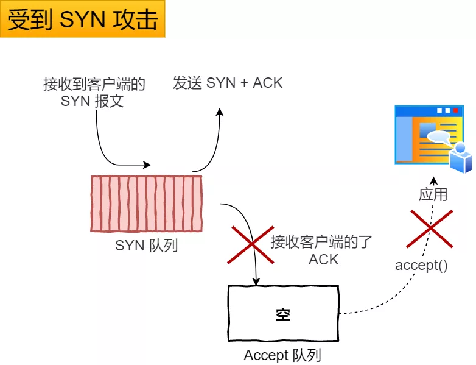

## SYN攻击防护
- 其中一种解决方式是通过修改 Linux 内核参数
- 第二种 net.ipv4.tcp_syncookies = 1
  - 当 「 SYN 队列」满之后，后续服务器收到 SYN 包，不进入「 SYN 队列」；
  - 计算出一个 cookie 值，再以 SYN + ACK 中的「序列号」返回客户端，
  - 服务端接收到客户端的应答报文时，服务器会检查这个 ACK 包的合法性。如果合法，直接放入到「 Accept 队列」。

