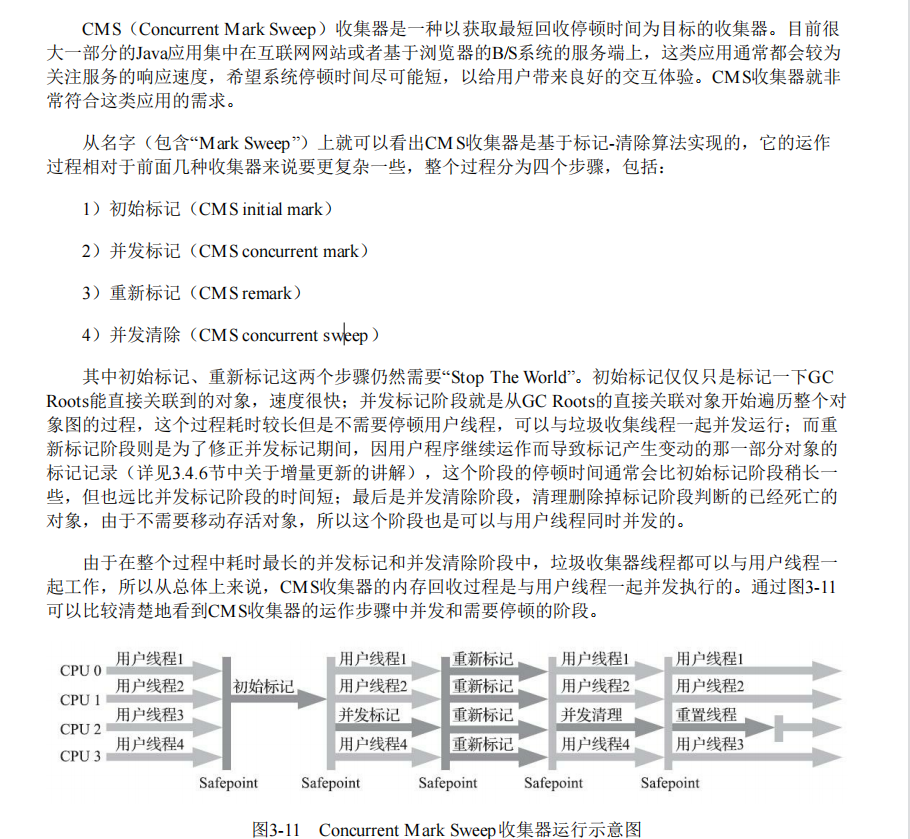

## 总结

> CMS（Concurrent Mark Sweep）收集器是一种以获取最短回收停顿时间为目标的收集器。CMS收集器主要有四个步骤，初始标记、并发标记、重新标记、并发清除。初始标记和重新标记仍然需要STW，初始标记仅仅只是标记一下GC Roots能直接关联到的对象，速度很快；并发标记阶段就是从GC Roots的直接关联对象开始遍历整个对 象图的过程，这个过程耗时较长但是不需要停顿用户线程，而重新标记阶段则是为了修正并发标记期间，因用户程序继续运作而导致标记产生变动的那一部分对象的标记记录。

> 会因为占用了一部分线程（或者说处理器的计算能力）而导致应用程序变慢，降低总吞吐量

> 在CMS的并发标记和并发清理阶段，用户线程是还在继续运行的，程序在运行自然就还会伴随有新的垃圾对象不断产生，但这一部分垃圾对象是出现在标记过程结束以后，CMS无法在当次收集中处理掉它们，只好留待下一次垃圾收集再清理掉。这一部分垃圾就称为“浮动垃圾”

> 标记-清理，内存碎片问题