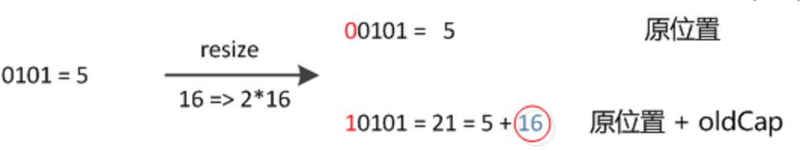

  ### HashMap
 
- HashMap就是使用哈希表来存储的。哈希表为解决冲突，可以采用开放地址法和链地址法等来解决问题
- Node[] table的初始化长度length(默认值是16)，Load factor为负载因子(默认值是0.75)，threshold = length * Load factor。超过这个数目就重新resize(扩容)，扩容后的HashMap容量是之前容量的两倍。
- 在HashMap中，哈希桶数组table的长度length大小必须为2的n次方(一定是合数)，这是一种非常规的设计，常规的设计是把桶的大小设计为素数。相对来说素数导致冲突的概率要小于合数，Hashtable初始化桶大小为11，就是桶大小设计为素数的应用（Hashtable扩容后不能保证还是素数）。HashMap采用这种非常规设计，主要是为了在取模和扩容时做优化，同时为了减少冲突，HashMap定位哈希桶索引位置时，也加入了高位参与运算的过程。
- 即使负载因子和Hash算法设计的再合理，也免不了会出现拉链过长的情况，一旦出现拉链过长，则会严重影响HashMap的性能。于是，在JDK1.8版本中，对数据结构做了进一步的优化，引入了红黑树。而当链表长度太长（默认超过8）时，链表就转换为红黑树
 
 - 这里的Hash算法本质上就是三步：取key的hashCode值、高位运算、取模运算
 - 我们首先想到的就是把hash值对数组长度取模运算，这样一来，元素的分布相对来说是比较均匀的。但是，模运算的消耗还是比较大的.它通过h & (table.length -1)来得到该对象的保存位，而HashMap底层数组的长度总是2的n次方，这是HashMap在速度上的优化。**当length总是2的n次方时，h& (length-1)运算等价于对length取模，也就是h%length，但是&比%具有更高的效率**。
 
  
 
 - 经过观测可以发现，**我们使用的是2次幂的扩展(指长度扩为原来2倍)，所以，元素的位置要么是在原位置，要么是在原位置再移动2次幂的位置**
 
 - 元素在重新计算hash之后，因为n变为2倍，那么n-1的mask范围在高位多1bit(红色)，因此新的index就会发生这样的变化：
 

- 从结构实现来讲，HashMap 1.8是数组+链表+红黑树实现的,初始化的Table默认的长度是16，有个默认的负载因子0.75，元素数目超过length乘以负载因子就进行resize，容量扩张为之前的两倍。当发生哈希冲突时，一般可以有开放地址法和拉链法解决，hashMap采用拉链法，当拉链长度超过8的时候变成红黑树。有个值得说的就是在HashMap中，哈希桶数组table的长度length大小必须为2的n次方，HashMap采用这种设计，主要是为了在取模和扩容时做优化，当length总是2的n次方时，h & (length-1)运算等价于对length取模，也就是h%length，但是&比%具有更高的效率。HashMap1.8扩容时不用再重新计算一次hash，由于它保证了数组的长度为2的n次方，所以它扩容后新元素要么在原位置要么在原位置+旧容量的位置。HashMap不是一个在多线程环境下使用的容器，在1.7会有死循环问题，1.8虽然用尾插法解决了但是还是可能存在数据不准确的问题。大概就这样
