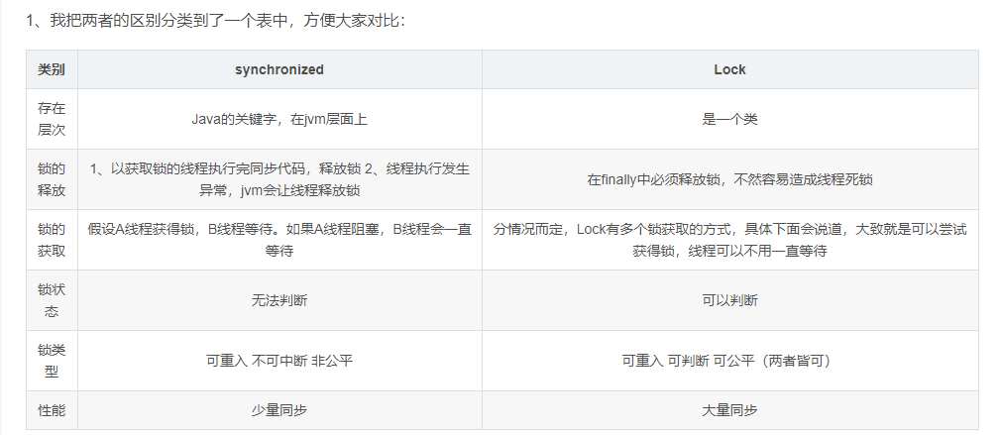

## volatile 关键字解决了什么问题，它的实现原理是什么？
- 它最原始的意义就是禁用 CPU 缓存，实现可见性
- 禁止指令重排序
- （1）修改volatile变量时会强制将修改后的值刷新的主内存中。（2）修改volatile变量后会导致其他线程工作内存中对应的变量值失效。因此，再读取该变量值的时候就需要重新从读取主内存中的值。
- 一个是对象头的markword，一个是aqs类的volatile int status

## synchronized 关键字底层是如何实现的？它与 Lock 相比优缺点分别是什么？

## ThreadLocal 实现原理是什么？
- 有一个 Map，叫做 ThreadLocalMap，持有 ThreadLocalMap 的是 Thread。Thread 这个类内部有一个私有属性 threadLocals，其类型就是 ThreadLocalMap，ThreadLocalMap 的 Key 是 ThreadLocal

- 线程池中线程的存活时间太长，往往都是和程序同生共死的，这就意味着 Thread 持有的 ThreadLocalMap 一直都不会被回收，再加上 ThreadLocalMap 中的 Entry 对 ThreadLocal 是弱引用（WeakReference），所以只要 ThreadLocal 结束了自己的生命周期是可以被回收掉的。但是 Entry 中的 Value 却是被 Entry 强引用的，所以即便 Value 的生命周期结束了，Value 也是无法被回收的，从而导致内存泄露。

## Java 线程和操作系统的线程是怎么对应的？Java线程是怎样进行调度的?

## Java 常见锁有哪些？ReetrantLock 是怎么实现的？
- AQS

## 简述 Java 的 happen before 原则

