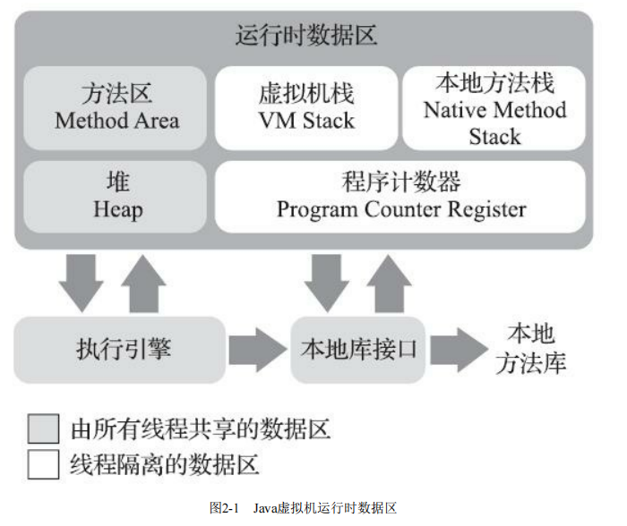

## 总结
> JVM内存模型是虚拟机自动内存管理机制下的重要部分，主要有程序计数器、方法区、堆、虚拟机栈、本地方法栈等部分组成。程序计数器可以看成是当前线程所执行的字节码的行号指示器，分支、循环、跳转、异常处理、线程恢复都需要依赖这个计数器来完成。虚拟机栈描述的是Java方法执行的线程内存模型：每个方法被执行的时候，Java虚拟机都会同步创建一个栈帧用于存储局部变量表、操作数栈等信息。本地方法栈为虚拟机使用到的本地（Native） 方法服务。还有堆用来存放对象实例。方法区（Method Area）用于存储已被虚拟机加载的类型信息、常量、静态变量等数据。还有个不属于JVM的直接内存