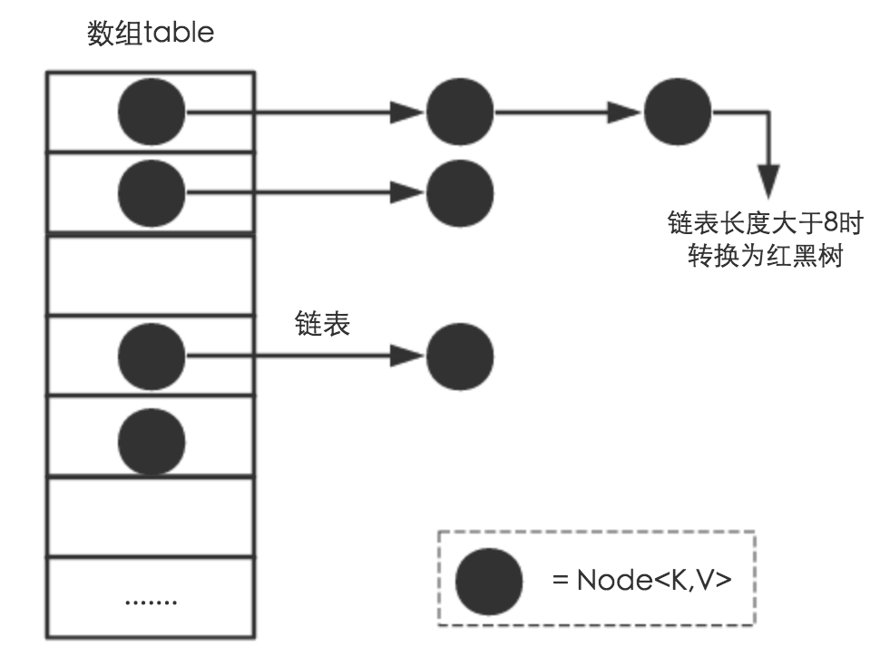

### \==和equals()
 - \==判断两个对象的地址是不是相等。即判断两个对象是不是同一个对象。(基本数据类型\==比较的是值，引用数据类型\==比较的是内存地址)
 - equals()是对象重新覆盖重写的方法，想怎样写都行
 - 当创建 String 类型的对象时，虚拟机会在常量池中查找有没有已经存在的值和要创建的值相同的对象，如果有就把它赋给当前引用。如果没有就在常量池中重新创建一个 String 对象。
 <br>
 

 ### hashCode()与 equals()
 - hashCode() 的作用是获取哈希码，也称为散列码；它实际上是返回一个 int 整数。这个哈希码的作用是确定该对象在哈希表中的索引位置.
 - equals()是对象重新覆盖重写的方法，想怎样写都行
 - 对于集合类元素来说，HashMap的put()方法实际上是先调用hashCode()定位到数组的**大致**位置,如果只重写了equals()方法
 - 对于对象集合的判重，用equals()性能太差
 - equals方法与hashCode方法根本就是**配套使用的**。对于任何一个对象，不论是使用继承自Object的equals方法还是重写equals方法。hashCode方法实际上必须要完成的一件事情就是，为该equals方法认定为相同的对象返回相同的哈希值。
 - hashCode方法的重写原则就是保证equals方法认定为相同的两个对象拥有相同的哈希值
  - 被String类中的equals方法认定为相等的两个对象拥有两个不同的哈希值（因为他们的地址值不同）

  ### HashMap
 
- HashMap就是使用哈希表来存储的。哈希表为解决冲突，可以采用开放地址法和链地址法等来解决问题
- Node[] table的初始化长度length(默认值是16)，Load factor为负载因子(默认值是0.75)，threshold = length * Load factor。超过这个数目就重新resize(扩容)，扩容后的HashMap容量是之前容量的两倍。
- 在HashMap中，哈希桶数组table的长度length大小必须为2的n次方(一定是合数)，这是一种非常规的设计，常规的设计是把桶的大小设计为素数。相对来说素数导致冲突的概率要小于合数，具体证明可以参考这篇文章，Hashtable初始化桶大小为11，就是桶大小设计为素数的应用（Hashtable扩容后不能保证还是素数）。HashMap采用这种非常规设计，主要是为了在取模和扩容时做优化，同时为了减少冲突，HashMap定位哈希桶索引位置时，也加入了高位参与运算的过程。
- 即使负载因子和Hash算法设计的再合理，也免不了会出现拉链过长的情况，一旦出现拉链过长，则会严重影响HashMap的性能。于是，在JDK1.8版本中，对数据结构做了进一步的优化，引入了红黑树。而当链表长度太长（默认超过8）时，链表就转换为红黑树
 
 - 这里的Hash算法本质上就是三步：取key的hashCode值、高位运算、取模运算
 - 我们首先想到的就是把hash值对数组长度取模运算，这样一来，元素的分布相对来说是比较均匀的。但是，模运算的消耗还是比较大的.它通过h & (table.length -1)来得到该对象的保存位，而HashMap底层数组的长度总是2的n次方，这是HashMap在速度上的优化。当length总是2的n次方时，h& (length-1)运算等价于对length取模，也就是h%length，但是&比%具有更高的效率。
 
 <br>
 
 - 经过观测可以发现，我们使用的是2次幂的扩展(指长度扩为原来2倍)，所以，元素的位置要么是在原位置，要么是在原位置再移动2次幂的位置
 

 ### ConcurrentHashMap 


 ### 双重锁实现单例模式
```
 public class Singleton {

    private volatile static Singleton uniqueInstance;

    private Singleton() {
    }

    public  static Singleton getUniqueInstance() {
       //先判断对象是否已经实例过，没有实例化过才进入加锁代码
        if (uniqueInstance == null) {
            //类对象加锁
            synchronized (Singleton.class) {
                if (uniqueInstance == null) {
                    uniqueInstance = new Singleton();
                }
            }
        }
        return uniqueInstance;
    }
 }
```

### 线程池


