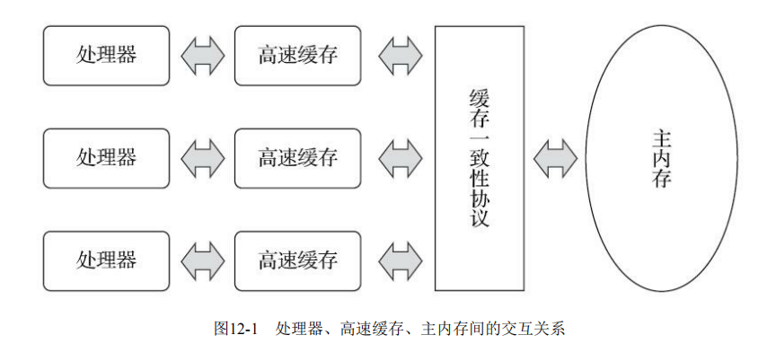
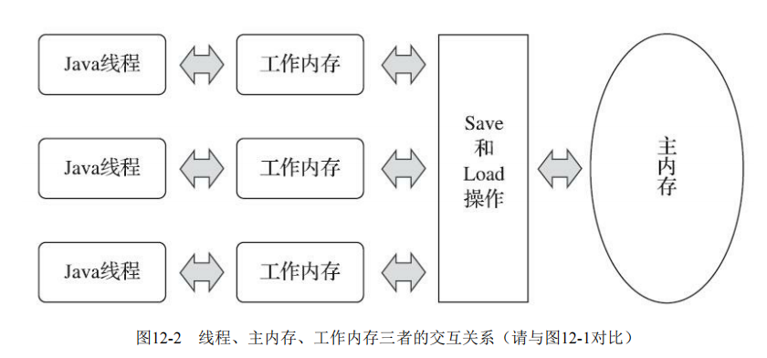

- 由于计算机 的存储设备与处理器的运算速度有着几个数量级的差距，所以现代计算机系统都不得不加入一层或多 层读写速度尽可能接近处理器运算速度的高速缓存（Cache）来作为内存与处理器之间的缓冲：将运算需要使用的数据复制到缓存中，让运算能快速进行，当运算结束后再从缓存同步回内存之中，这样处理器就无须等待缓慢的内存读写了

- 《Java虚拟机规范》[1]中曾试图定义一种“Java内存模型”[2]（Java Memory Model，JMM）来屏 蔽各种硬件和操作系统的内存访问差异，以实现让Java程序在各种平台下都能达到一致的内存访问效果。
   