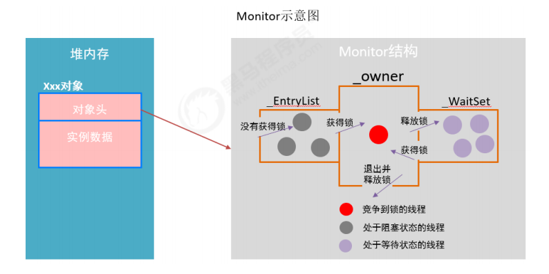

- 无论是synchronized代码块还是synchronized方法，其线程安全的语义实现最终依赖一个叫monitor的东西，在HotSpot虚拟机中，monitor是由ObjectMonitor实现的。ObjectMonitor主要数据结构如下
  - 1. _owner：初始时为NULL。当有线程占有该monitor时，owner标记为该线程的唯一标识。当线程释放monitor时，owner又恢复为NULL。owner是一个临界资源，JVM是通过CAS操作来保证其线程安全的。
  - 2. _cxq：竞争队列，所有请求锁的线程首先会被放在这个队列中（单向链接）。_cxq是一个临界资源，JVM通过CAS原子指令来修改_cxq队列。修改前_cxq的旧值填入了node的next字段，_cxq指向新值（新线程）。因此_cxq是一个后进先出的stack（栈）。
  - 3. _EntryList：_cxq队列中有资格成为候选资源的线程会被移动到该队列中。
  - 4. _WaitSet：因为调用wait方法而被阻塞的线程会被放在该队列中。

- monitor竞争
  - 通过CAS尝试把monitor的owner字段设置为当前线程。
  - 如果设置之前的owner指向当前线程，说明当前线程再次进入monitor，即重入锁，执行recursions ++ ，记录重入的次数。如果当前线程是第一次进入该monitor，设置recursions为1，_owner为当前线程，该线程成功获得锁并返回。