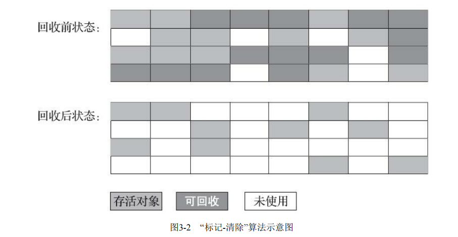
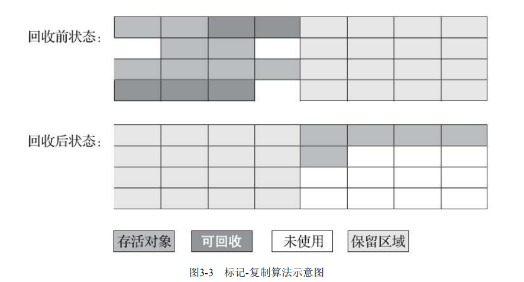
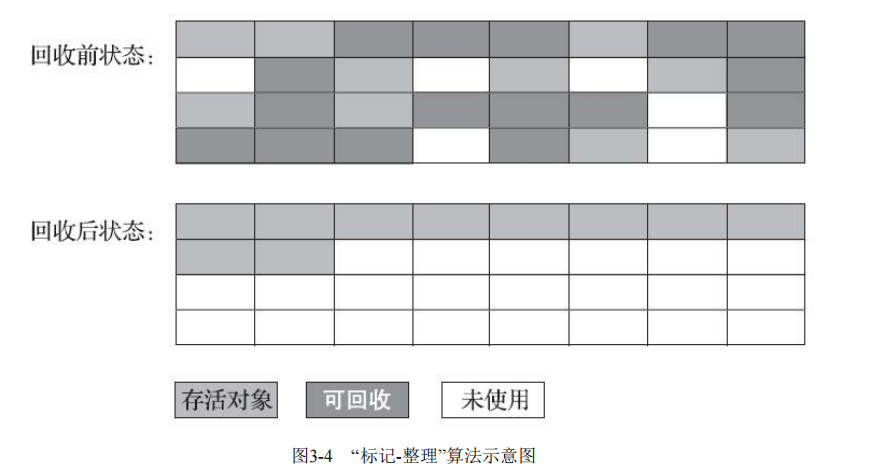

## 总结
> 主要有标记-清除、标记-复制、标记-整理算法，标记-清除会标记出所有需要回收的对象，标记完成后统一回收所有被标记的对象，也可以反过来，缺点一是Java堆中有大量对象时执行效率不稳定，二是会有内存空间的碎片化问题。

> 标记-复制就是将可用内存按容量划分为大小相等的两块，每次只使用其中的一块，当这一块的内存用完了，就将还存活着 的对象复制到另外一块上面，然后再把已使用过的内存空间一次清理掉，缺点是空间浪费严重，可以把新生代分为一块较大的Eden空间和两块较小的 Survivor空间，8:1:1的比例。

> 标记-整理算法是一种移动式的回收算法，让所有存活的对象都向内存空间一端移动，然后直接清理掉边界以外的内存，移动存活对象并更新所有引用这些对象的地方将会是一种极为负重的操作，而且这种对象移动操作必须全程暂停用户应用程序才能进行，有“和稀泥式”解决方案可以不在内存分配和访问上增加太大额外负担，做法是让虚拟机平时多数时间都采用标记-清除算法，暂时容忍内存碎片的存在，直到内存空间的碎片化程度已经 大到影响对象分配时，再采用标记-整理算法收集一次，以获得规整的内存空间。