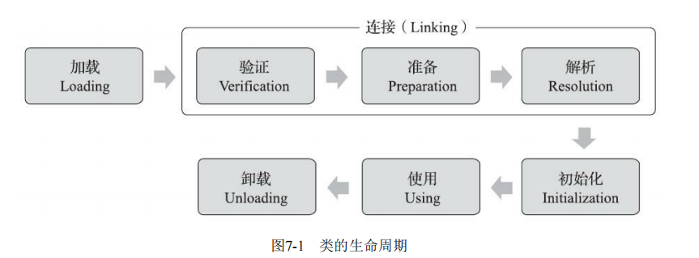

##总结
> JVM类加载的全过程有五个阶段，即加载、验证、准备、解析、初始化。

> 第一步加载是通过类的全限定名来获取二进制字节流，将这个字节流所代表的静态存储结构转化为方法区的运行时数据结构，再在内存中生成一个对象。（动态代理在此过程完成）

> 第二步验证的目的是保证这些信息被当作代码运行后不会危害虚拟机自身的安全。有文件格式验证、元数据验证、字节码验证、符号引用验证等步骤

> 准备阶段是正式为类中定义的变量（即静态变量，被static修饰的变量）分配内存并设置类变量初 始值的阶段，如果有ConstantValue属性即final关键字就会被直接初始化指定的初始值。

> 解析阶段是Java虚拟机将常量池内的符号引用替换为直接引用的过程，

> 进行准备阶段时，变量已经赋过一次系统要求的初始零值，而在初始化阶段，则会根据程序员通过程序编码制定的主观计划去初始化类变量和其他资源,初始化阶段就是执行类构造器<clinit>()方法的过程.