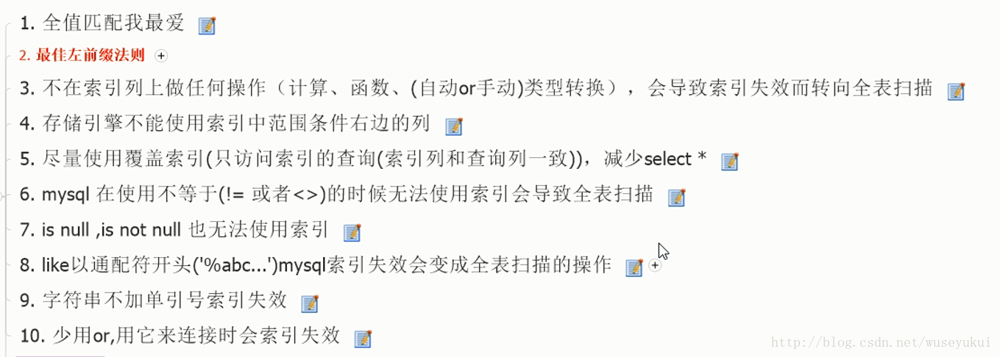

## MySQL 为什么使用 B+ 树来作索引，对比 B 树它的优点和缺点是什么？
- B+ 树。它通过存储在磁盘的多叉树结构，做到了时间、空间的平衡，既保证了执行效率，又节省了内存
- 通过链表将叶子节点串联在一起，这样可以方便按区间查找
- 一般情况，根节点会被存储在内存中，其他节点存储在磁盘中
- 而 B 树实际上是低级版的 B+ 树，或者说 B+ 树是 B 树的改进版。B 树跟 B+ 树的不同点主要集中在这几个地方：B+ 树中的节点不存储数据，只是索引，而 B 树中的节点存储数据；B 树中的叶子节点并不需要链表来串联。

## 数据库的事务隔离级别有哪些？各有哪些优缺点？
- 读未提交（read uncommitted）、读提交（read committed）、可重复读（repeatable read）和串行化（serializable 

## 什么情况下会发生死锁，如何解决死锁？
- 如上面的案例一和案例三所示，对索引加锁顺序的不一致很可能会导致死锁，所以如果可以，尽量以相同的顺序来访问索引记录和表。在程序以批量方式处理数据的时候，如果事先对数据排序，保证每个线程按固定的顺序来处理记录，也可以大大降低出现死锁的可能；
- 如上面的案例二所示，Gap 锁往往是程序中导致死锁的真凶，由于默认情况下 MySQL 的隔离级别是 RR，所以如果能确定幻读和不可重复读对应用的影响不大，可以考虑将隔离级别改成 RC，可以避免 Gap 锁导致的死锁；
- 为表添加合理的索引，如果不走索引将会为表的每一行记录加锁，死锁的概率就会大大增大；
我们知道 MyISAM 只支持表锁，它采用一次封锁技术来保证事务之间不会发生死锁，所以，我们也可以使用同样的思想，在事务中一次锁定所需要的所有资源，减少死锁概率；
- 避免大事务，尽量将大事务拆成多个小事务来处理；因为大事务占用资源多，耗时长，与其他事务冲突的概率也会变高；
- 避免在同一时间点运行多个对同一表进行读写的脚本，特别注意加锁且操作数据量比较大的语句；我们经常会有一些定时脚本，避免它们在同一时间点运行；
- 设置锁等待超时参数：innodb_lock_wait_timeout，这个参数并不是只用来解决死锁问题，在并发访问比较高的情况下，如果大量事务因无法立即获得所需的锁而挂起，会占用大量计算机资源，造成严重性能问题，甚至拖跨数据库。我们通过设置合适的锁等待超时阈值，可以避免这种情况发生。
- mysql 加锁处理分析 何登成

## 幻读解决
- 产生幻读的原因是，行锁只能锁住行，但是新插入记录这个动作，要更新的是记录之间的“间隙”。因此，为了解决幻读问题，InnoDB 只好引入新的锁，也就是间隙锁 (Gap Lock)。
- 跟间隙锁存在冲突关系的，是“往这个间隙中插入一个记录”这个操作。间隙锁之间都不存在冲突关系。
- 间隙锁的引入，可能会导致同样的语句锁住更大的范围，这其实是影响了并发度的

## 聚簇索引和非聚簇索引有什么区别？什么情况用聚集索引？
- 主键索引的叶子节点存的是整行数据。在 InnoDB 里，主键索引也被称为聚簇索引（clustered index）。
- 非主键索引的叶子节点内容是主键的值。在 InnoDB 里，非主键索引也被称为二级索引（secondary index）。
- 如果执行的语句是 select ID from T where k between 3 and 5，这时只需要查 ID 的值，而 ID 的值已经在 k 索引树上了，因此可以直接提供查询结果，不需要回表。也就是说，在这个查询里面，索引 k 已经“覆盖了”我们的查询需求，我们称为覆盖索引。

## 普通索引和唯一索引选择
#### 查询
- InnoDB 的数据是按数据页为单位来读写的。也就是说，当需要读一条记录的时候，并不是将这个记录本身从磁盘读出来，而是以页为单位，将其整体读入内存。在 InnoDB 中，每个数据页的大小默认是 16KB。
- 因为引擎是按页读写的，所以说，当找到 k=5 的记录的时候，它所在的数据页就都在内存里了。那么，对于普通索引来说，要多做的那一次“查找和判断下一条记录”的操作，就只需要一次指针寻找和一次计算。
- 对于整型字段，一个数据页可以放近千个 key，因此出现这种情况的概率会很低。所以，我们计算平均性能差异时，仍可以认为这个操作成本对于现在的 CPU 来说可以忽略不计。
#### 更新
- change buffer
- 当需要更新一个数据页时，如果数据页在内存中就直接更新，而如果这个数据页还没有在内存中的话，在不影响数据一致性的前提下，InooDB 会将这些更新操作缓存在 change buffer 中，这样就不需要从磁盘中读入这个数据页了。在下次查询需要访问这个数据页的时候，将数据页读入内存，然后执行 change buffer 中与这个页有关的操作。通过这种方式就能保证这个数据逻辑的正确性。
- 唯一索引的更新就不能使用 change buffer，实际上也只有普通索引可以使用。
- redo log 主要节省的是随机写磁盘的 IO 消耗（转成顺序写），而 change buffer 主要节省的则是随机读磁盘的 IO 消耗。

## MySQL 的索引什么情况下会失效？
 
## 数据库设计的范式是什么？
- 1NF的定义为：符合1NF的关系中的每个属性都不可再分。
- 2NF在1NF的基础上，数据库表中不存在非关键字段对任一候选键的部分函数依赖。
- 在第二范式的基础上，数据表中如果不存在非关键字段对任一候选关键字段的传递函数依赖则符合第三范式
## 简述 MySQL MVCC 的实现原理
- UNDO LOG
- 版本号

## MySQL 有什么调优的方式？
- 优化范围
  - 存储、主机和操作系统方面：主机架构稳定性、I/O 规划及配置、Swap 交换分区、OS 内核参数和网络问题
  - 应用程序方面：应用程序稳定性、SQL 语句性能、串行访问资源、性能欠佳会话管理
  - 数据库优化方面：内存、数据库结构(物理&逻辑)、实例配置

## 简述数据库中什么情况下进行分库，什么情况下进行分表？
- 尚硅谷教程
## 数据库连接查询
 

## 数据库的读写分离的作用是什么？如何实现？
- 尚硅谷教程

## MySQL 有哪些常见的存储引擎？它们的区别是什么？
## 联合索引的存储结构是什么？
## 假设建立联合索引 (a, b, c) 如果对字段 a 和 c 查询，会用到这个联合索引吗？
