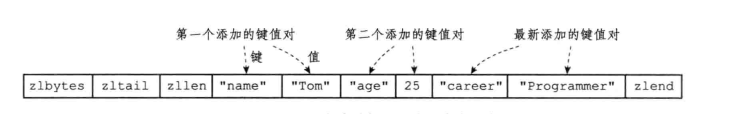
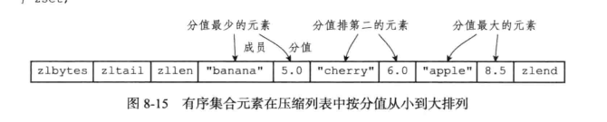

- 对象的ptr指针指向对象的底层实现数据结构，而这些数据结构由对象的encoding属性决定，encoding属性记录了这个对象使用了什么数据结构作为对象的底层实现，
通过encoding属性来设定对象所使用的编码，而不是为特定类型的对象关联一种固定的编码，极大地提升了Redis的灵活性和效率

- 字符串对象的编码可以是int、raw、或者embstr，如果字符串对象保存的是一个字符串值，并且这个字符串值的长度大于32字节，那么字符串对象将使用一个SDS来保存
这个字符串值，并将对象的编码设置为raw，如果长度小于等于32字节，那么会用embstr编码的方式来保存这个字符串值，使用embstr编码可以减少内存分配次数，是连续的
内存分配，long、Double这类浮点数也是作为字符串值来保存的。embstr对象实际是只读的，append以后会变成raw对象。

- 列表对象可以是ziplist或者linkedlist(双端链表)，当列表保存的所有字符串长度都小于64字节，并且列表保存的元素数量小于512个将维持ziplist结构。

- 哈希对象的编码可以是ziplist或者hashtable，如果使用ziplist，那保存了同一键值对的两个节点总是紧挨在一起，保存键的节点在前，保存值的节点在后，
 当哈希对象保存的所有键值对的键和值的字符串长度都小于64字节，哈希对象保存的键值对数量小于512个将维持ziplist

 - 集合对象的编码可以是intset或者hashtable，当集合对象保存的所有元素都是整数值且保存的元素数量不超过52个将维持intset编码。

 - 有序集合对象的编码可以是ziplist或者skiplist，ziplist每个集合元素使用两个紧挨在一起的压缩列表节点来保存，
 skiplist编码的有序集合对象使用zset结构作为底层实现，一个zset结构同时包含一个字典和一个跳跃表zsl，通过这个zsl跳跃表
 程序可以对有序集合进行范围操作，比如ZRANK,ZRANGE，dict可以单次O(1)查询，这两种结构结合方便同时使用范围和单个查询，有序
 集合元素小于128个，保存的所有元素成员的长度都小于64字节将维持ziplist结构。

