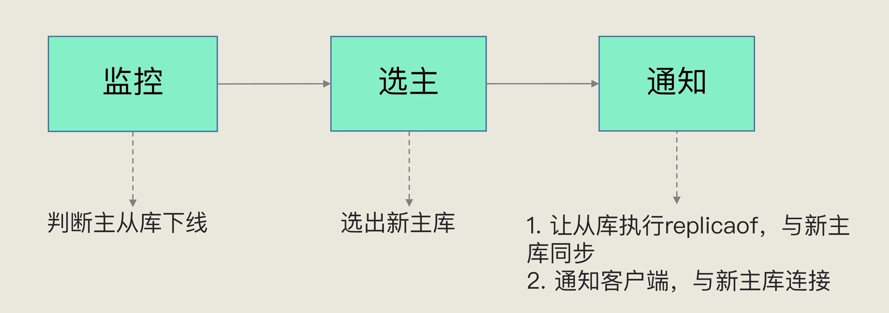

## Redis底层数据结构
#### Redis底层数据
 

#### Redis组织结构
 - 哈希桶中的元素保存的并不是值本身，而是指向具体值的指针。这也就是说，不管值是 String，还是集合类型，哈希桶中的元素都是指向它们的指针。
 

 - 为了避免rehash时全量复制时造成的阻塞，Redis采用**渐进式rehash**来解决问题，每次处理一个索引位置的数据。
 

 #### 压缩列表
 - 压缩列表实际上类似于一个数组，数组中的每一个元素都对应保存一个数据。和数组不同的是，压缩列表在表头有三个字段 zlbytes、zltail 和 zllen，分别表示列表长度、列表尾的偏移量和列表中的 entry 个数；压缩列表在表尾还有一个 zlend，表示列表结束。**压缩列表和双向链表都会记录表头和表尾的偏移量**，这样一来，对于 List 类型的 LPOP、RPOP、LPUSH、RPUSH 这四个操作来说，它们是在列表的头尾增删元素，这就可以通过偏移量直接定位，所以它们的复杂度也只有 O(1)，可以实现快速操作。
 

## Redis IO模型

#### Redis单线程
- 我们通常说，Redis 是单线程，主要是指**Redis 的网络 IO 和键值对读写是由一个线程来完成的，这也是 Redis 对外提供键值存储服务的主要流程**

- 多线程额外的机制带来额外的开销，多线程编程模式面临的共享资源的并发访问控制问题。

#### 单线程为什么这么快
- 内存上操作、高效的数据结构、多路复用机制
- 在Redis只运行单线程的机制上，**该机制允许内核中，同时存在多个监听套接字和已连接套接字**，。内核会一直监听这些套接字上的连接请求或数据请求。一旦有请求到达，就会交给 Redis 线程处理。
- 基于事件的回调机制，针对不同事件的发生，调用相应的处理函数

## AOF日志

#### AOF日志实现
-  AOF 里记录的是 Redis 收到的每一条命令，这些命令是以文本形式保存的。
-  AOF 日志无法保证事务的一致性
-  AOF 虽然避免了对当前命令的阻塞，但可能会给下一个操作带来阻塞风险。这是因为，AOF 日志也是在主线程中执行的，如果在把日志文件写入磁盘时，磁盘写压力大，就会导致写盘很慢，进而导致后续的操作也无法执行了。

#### AOF的写回策略

### AOF日志重写
- 重写删改数据逻辑，减少日志大小
- **一个拷贝，两个日志**

## RDB
- save
- bgsave

#### 快照时数据能修改吗?
- 为了快照而暂停写操作，肯定是不能接受的。所以这个时候，Redis 就会借助操作系统提供的写时复制技术（Copy-On-Write, COW），在执行快照的同时，正常处理写操作。
- 简单来说，bgsave 子进程是由主线程 fork 生成的，可以共享主线程的所有内存数据。bgsave 子进程运行后，开始读取主线程的内存数据，并把它们写入 RDB 文件。
- 如果主线程要修改一块数据（例如图中的键值对 C），那么，这块数据就会被复制一份，生成该数据的副本。然后，bgsave 子进程会把这个副本数据写入 RDB 文件，而在这个过程中，主线程仍然可以直接修改原来的数据。

- 频繁RDB带来的麻烦，系统资源消耗多，可以混用AOF和内存快照

## 哨兵机制

#### 哨兵的基本流程
- 哨兵其实就是一个运行在特殊模式下的 Redis 进程，主从库实例运行的同时，它也在运行。哨兵主要负责的就是三个任务：**监控、选主（选择主库）和通知**。

#### 主观下线和客观下线
- 单个哨兵实例判断下线为主观下线，哨兵集群超半数认定下线为客观下线

#### 如何选定新主库
- 检查从库的当前在线状态，判断它之前的网络连接状态
- 从库优先级、从库复制进度以及从库 ID 号