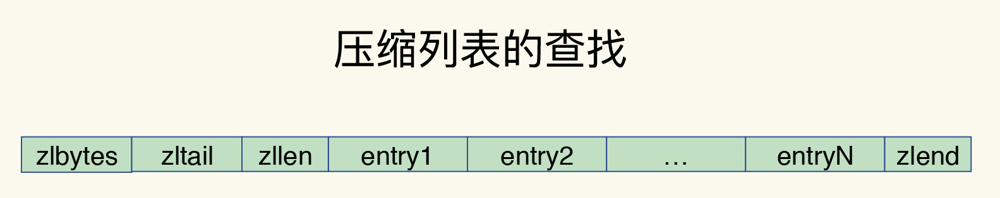

## Redis底层数据结构
#### Redis底层数据
 

#### Redis组织结构
 - 哈希桶中的元素保存的并不是值本身，而是指向具体值的指针。这也就是说，不管值是 String，还是集合类型，哈希桶中的元素都是指向它们的指针。
 

 - 为了避免rehash时全量复制时造成的阻塞，Redis采用**渐进式rehash**来解决问题，每次处理一个索引位置的数据。
 

 #### 压缩列表
 - 压缩列表实际上类似于一个数组，数组中的每一个元素都对应保存一个数据。和数组不同的是，压缩列表在表头有三个字段 zlbytes、zltail 和 zllen，分别表示列表长度、列表尾的偏移量和列表中的 entry 个数；压缩列表在表尾还有一个 zlend，表示列表结束。**压缩列表和双向链表都会记录表头和表尾的偏移量**，这样一来，对于 List 类型的 LPOP、RPOP、LPUSH、RPUSH 这四个操作来说，它们是在列表的头尾增删元素，这就可以通过偏移量直接定位，所以它们的复杂度也只有 O(1)，可以实现快速操作。
 

## Redis IO模型

#### Redis单线程
- 我们通常说，Redis 是单线程，主要是指**Redis 的网络 IO 和键值对读写是由一个线程来完成的，这也是 Redis 对外提供键值存储服务的主要流程**

- 多线程额外的机制带来额外的开销，多线程编程模式面临的共享资源的并发访问控制问题。

#### 单线程为什么这么快
- 内存上操作、高效的数据结构、多路复用机制
- 在Redis只运行单线程的机制上，**该机制允许内核中，同时存在多个监听套接字和已连接套接字**，。内核会一直监听这些套接字上的连接请求或数据请求。一旦有请求到达，就会交给 Redis 线程处理。
- 基于事件的回调机制，针对不同事件的发生，调用相应的处理函数
