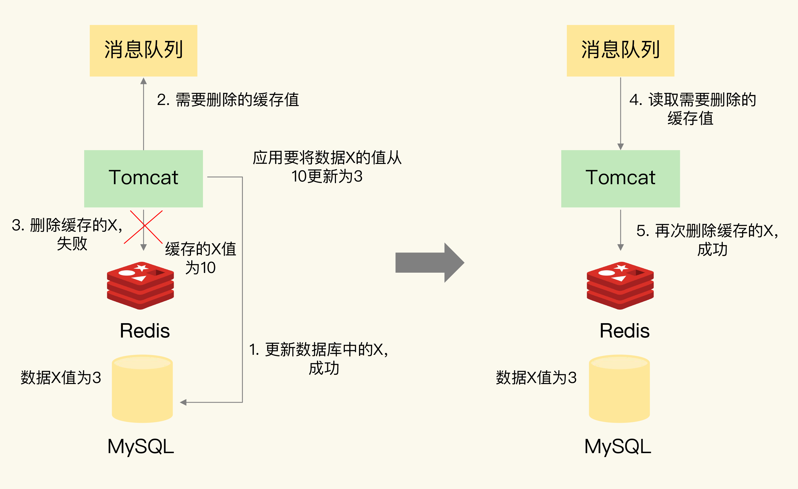

## Redis底层数据结构
#### Redis底层数据
 

#### Redis组织结构
 - 哈希桶中的元素保存的并不是值本身，而是指向具体值的指针。这也就是说，不管值是 String，还是集合类型，哈希桶中的元素都是指向它们的指针。
 

 - 为了避免rehash时全量复制时造成的阻塞，Redis采用**渐进式rehash**来解决问题，每次处理一个索引位置的数据。
 

 #### 压缩列表
 - 压缩列表实际上类似于一个数组，数组中的每一个元素都对应保存一个数据。和数组不同的是，压缩列表在表头有三个字段 zlbytes、zltail 和 zllen，分别表示列表长度、列表尾的偏移量和列表中的 entry 个数；压缩列表在表尾还有一个 zlend，表示列表结束。**压缩列表和双向链表都会记录表头和表尾的偏移量**，这样一来，对于 List 类型的 LPOP、RPOP、LPUSH、RPUSH 这四个操作来说，它们是在列表的头尾增删元素，这就可以通过偏移量直接定位，所以它们的复杂度也只有 O(1)，可以实现快速操作。
 

## Redis IO模型

#### Redis单线程
- 我们通常说，Redis 是单线程，主要是指**Redis 的网络 IO 和键值对读写是由一个线程来完成的，这也是 Redis 对外提供键值存储服务的主要流程**

- 多线程额外的机制带来额外的开销，多线程编程模式面临的共享资源的并发访问控制问题。

#### 单线程为什么这么快
- 内存上操作、高效的数据结构、多路复用机制
- 在Redis只运行单线程的机制上，**该机制允许内核中，同时存在多个监听套接字和已连接套接字**，。内核会一直监听这些套接字上的连接请求或数据请求。一旦有请求到达，就会交给 Redis 线程处理。
- 基于事件的回调机制，针对不同事件的发生，调用相应的处理函数

## AOF日志

#### AOF日志实现
-  AOF 里记录的是 Redis 收到的每一条命令，这些命令是以文本形式保存的。
-  AOF 日志无法保证事务的一致性
-  AOF 虽然避免了对当前命令的阻塞，但可能会给下一个操作带来阻塞风险。这是因为，AOF 日志也是在主线程中执行的，如果在把日志文件写入磁盘时，磁盘写压力大，就会导致写盘很慢，进而导致后续的操作也无法执行了。

#### AOF的写回策略

### AOF日志重写
- 重写删改数据逻辑，减少日志大小
- **一个拷贝，两个日志**

## RDB
- save
- bgsave

#### 快照时数据能修改吗?
- 为了快照而暂停写操作，肯定是不能接受的。所以这个时候，Redis 就会借助操作系统提供的写时复制技术（Copy-On-Write, COW），在执行快照的同时，正常处理写操作。
- 简单来说，bgsave 子进程是由主线程 fork 生成的，可以共享主线程的所有内存数据。bgsave 子进程运行后，开始读取主线程的内存数据，并把它们写入 RDB 文件。
- 如果主线程要修改一块数据（例如图中的键值对 C），那么，这块数据就会被复制一份，生成该数据的副本。然后，bgsave 子进程会把这个副本数据写入 RDB 文件，而在这个过程中，主线程仍然可以直接修改原来的数据。

- 频繁RDB带来的麻烦，系统资源消耗多，可以混用AOF和内存快照

## 哨兵机制

#### 哨兵的基本流程
- 哨兵其实就是一个运行在特殊模式下的 Redis 进程，主从库实例运行的同时，它也在运行。哨兵主要负责的就是三个任务：**监控、选主（选择主库）和通知**。

#### 主观下线和客观下线
- 单个哨兵实例判断下线为主观下线，哨兵集群超半数认定下线为客观下线

#### 如何选定新主库
- 检查从库的当前在线状态，判断它之前的网络连接状态
- 从库优先级、从库复制进度以及从库 ID 号

## 切片集群

#### 切片集群架构图

- 从 3.0 开始，官方提供了一个名为 Redis Cluster 的方案
- 具体来说，Redis Cluster 方案采用哈希槽（Hash Slot），来处理数据和实例之间的映射关系。在 Redis Cluster 方案中，一个切片集群共有 16384 个哈希槽，这些哈希槽类似于数据分区，每个键值对都会根据它的 key，被映射到一个哈希槽中。
- 具体的映射过程分为两大步：首先根据键值对的 key，按照CRC16算法计算一个 16 bit 的值；然后，再用这个 16bit 值对 16384 取模，得到 0~16383 范围内的模数，每个模数代表一个相应编号的哈希槽。关于 CRC16 算法，不是这节课的重点，你简单看下链接中的资料就可以了。
- 如果集群中有 N 个实例，那么，每个实例上的槽个数为 16384/N 个。

## 统计相关

#### 聚合统计
- 所谓的聚合统计，就是指统计多个集合元素的聚合结果，包括：统计多个集合的共有元素（交集统计）；把两个集合相比，统计其中一个集合独有的元素（差集统计）；统计多个集合的所有元素（并集统计）。

#### 排序统计
- List 是按照元素进入 List 的顺序进行排序的，而 Sorted Set 可以根据元素的权重来排序

#### 二值状态统计
- Bitmap
- 如果记录了 1亿个用户 10 天的签到情况，统计出这 10 天连续签到的用户总数

#### 基数统计
-  HyperLogLog
- HyperLogLog 是一种用于统计基数的数据集合类型，它的最大优势就在于，当集合元素数量非常多时，它计算基数所需的空间总是固定的，而且还很小。
- HyperLogLog 的统计规则是基于概率完成的，所以它给出的统计结果是有一定误差的，标准误算率是 0.81%。这也就意味着，你使用 HyperLogLog 统计的 UV 是 100 万，但实际的 UV 可能是 101 万。虽然误差率不算大，但是，如果你需要精确统计结果的话，最好还是继续用 Set 或 Hash 类型。

## 缓存和数据库的数据不一致
#### 缓存和数据库的数据不一致是如何发生

#### 如何解决数据不一致问题
- 重试，利用消息队列

- 并发下可采取延迟双删的策略

- binlog
- 总结

## 缓存雪崩、缓存击穿和缓存穿透
#### 缓存雪崩
- 设置随机过期时间
- 服务降级，访问非核心数据时暂时返回预定义信息、空值

#### 缓存击穿
- 缓存击穿是指，针对某个访问非常频繁的热点数据的请求，无法在缓存中进行处理，紧接着，访问该数据的大量请求，一下子都发送到了后端数据库，导致了数据库压力激增，会影响数据库处理其他请求。缓存击穿的情况，经常发生在热点数据过期失效时
- 针对访问频繁的数据不设过期时间
#### 缓存穿透
- 缓存穿透是指要访问的数据既不在 Redis 缓存中，也不在数据库中，导致请求在访问缓存时，发生缓存缺失，再去访问数据库时，发现数据库中也没有要访问的数据。此时，应用也无法从数据库中读取数据再写入缓存，来服务后续请求，这样一来，缓存也就成了“摆设”，如果应用持续有大量请求访问数据，就会同时给缓存和数据库带来巨大压力
- 缓存空值、缺省值
- 布隆过滤器

## Redis分布式锁

#### 分布式锁
- SETNX 命令对于不存在的键值对，它会先创建再设置值（也就是“不存在即设置”），为了能达到和 SETNX 命令一样的效果，Redis 给 SET 命令提供了类似的选项 NX，用来实现“不存在即设置”。如果使用了 NX 选项，SET 命令只有在键值对不存在时，才会进行设置，否则不做赋值操作。此外，SET 命令在执行时还可以带上 EX 或 PX 选项，用来设置键值对的过期时间。
- Redis 高可靠分布式锁RedLock，请求所有节点获取锁，半数成功加锁成功

## Redis的ACID

#### Redis 如何实现事务
- Redis 提供了 MULTI、EXEC 两个命令来完成

#### Redis 的事务机制能保证哪些属性
- 原子性
  - 命令入队时就报错，会放弃事务执行，保证原子性；
  - 命令入队时没报错，实际执行时报错，不保证原子性；
  - EXEC 命令执行时实例故障，如果开启了 AOF 日志，可以保证原子性。
- 报错就不执行，一致性可以保证
- 隔离性不保证
- 持久性不保证

## 题目

#### Redis Zset 数据结构
-  zset底层的存储结构包括ziplist或skiplist，在同时满足以下两个条件的时候使用ziplist，其他时候使用skiplist，两个条件如下：
有序集合保存的元素数量小于128个
有序集合保存的所有元素的长度小于64字节
