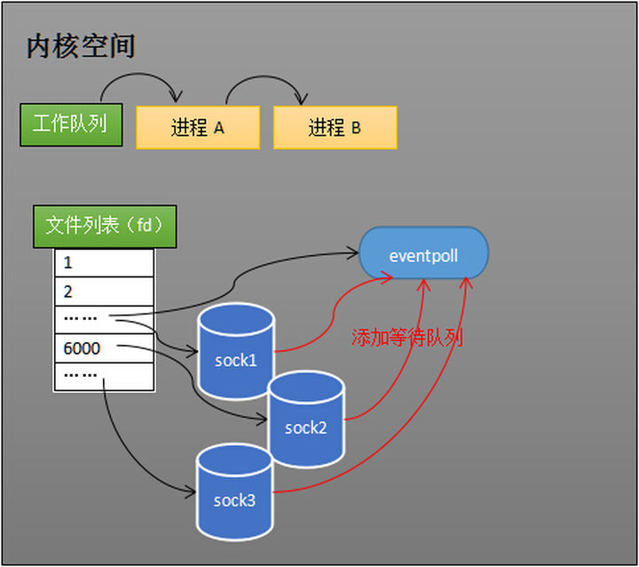

- 内核接收网络数据全过程
> 如下图所示，进程在recv阻塞期间，计算机收到了对端传送的数据（步骤①）。数据经由网卡传送到内存（步骤②），然后网卡通过中断信号通知cpu有数据到达，cpu执行中断程序（步骤③）。此处的中断程序主要有两项功能，先将网络数据写入到对应socket的接收缓冲区里面（步骤④），再唤醒进程A（步骤⑤），重新将进程A放入工作队列中。

- select的流程
  - 假如程序同时监视如下图的sock1、sock2和sock3三个socket，那么在调用select之后，操作系统把进程A分别加入这三个socket的等待队列中。

  - 当任何一个socket收到数据后，中断程序将唤起进程。下图展示了sock2接收到了数据的处理流程。

  - 唤起进程，就是将进程从所有的等待队列中移除，加入到工作队列里面

  - 经由这些步骤，当进程A被唤醒后，它知道至少有一个socket接收了数据。程序只需遍历一遍socket列表，就可以得到就绪的socket。
  - 缺点：每次调用select都需要将进程加入到所有监视socket的等待队列，每次唤醒都需要从每个队列中移除，进程被唤醒后，程序并不知道哪些socket收到数据，还需要遍历一次

- epoll的设计思路
  - select低效的原因之一是将“维护等待队列”和“阻塞进程”两个步骤合二为一
  
  - 创建epoll对象，如下图所示，当某个进程调用epoll_create方法时，内核会创建一个eventpoll对象（也就是程序中epfd所代表的对象）。eventpoll对象也是文件系统中的一员，和socket一样，它也会有等待队列。
  
  - 创建epoll对象后，可以用epoll_ctl添加或删除所要监听的socket，当socket收到数据后，中断程序会操作eventpoll对象，而不是直接操作进程。
  
  - 当socket收到数据后，中断程序会给eventpoll的“就绪列表”添加socket引用
  
  - 假设计算机中正在运行进程A和进程B，在某时刻进程A运行到了epoll_wait语句。如下图所示，内核会将进程A放入eventpoll的等待队列中，阻塞进程。
  
  - 当socket接收到数据，中断程序一方面修改rdlist，另一方面唤醒eventpoll等待队列中的进程，进程A再次进入运行状态（如下图）。也因为rdlist的存在，进程A可以知道哪些socket发生了变化。
  
  - LT模式下，只要内核缓冲区中还有未读数据，就会一直返回描述符的就绪状态，即不断地唤醒应用进程。在ET模式下， 缓冲区从不可读变成可读，会唤醒应用进程，缓冲区数据变少的情况，则不会再唤醒应用进程。

 