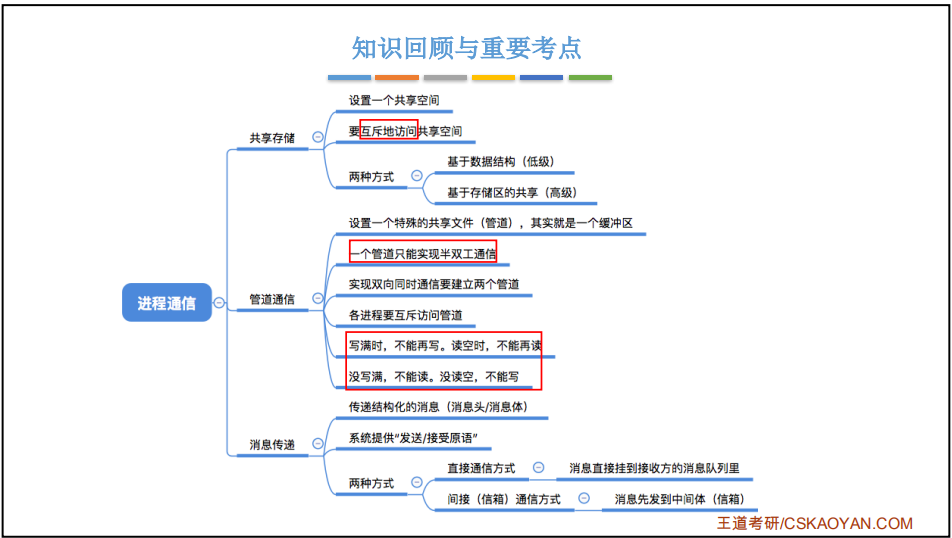
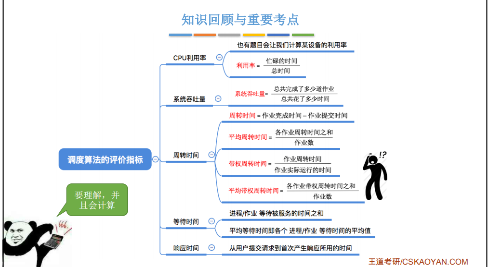
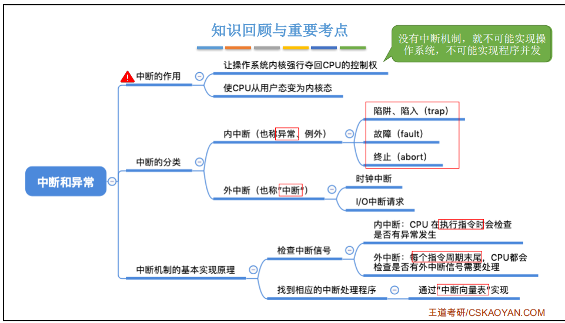
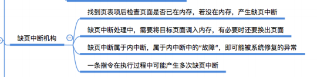

## 进程和线程之间有什么区别？
- 线程是一个基本的CPU执行单元，也是程序执行流的最小单位。
- 引入线程后，进程只作为除CPU之外的系统资源的分配单元（如打印机、内存地址空间等都是分配给进程的）。线程则作为处理机的分配单元。
- task_struct，线程共享同一个mm_struct

## 进程间有哪些通信方式？
- 进程通信就是指进程之间的信息交换

## 简述 socket 中 select 与 epoll 的使用场景以及区别，epoll 中水平触发以及边缘触发有什么不同？
- select是不断轮询去监听的socket，socket个数有限制，一般为1024个；poll还是采用轮询方式监听，只不过没有个数限制；epoll并不是采用轮询方式去监听了，而是当socket有变化时通过回调的方式主动告知用户进程。

## Linux 进程调度中有哪些常见算法以及策略？

- 调度算法:先来先服务、短作业优先、高响应比优先、时间片轮转、优先级调度、多级反馈队列调度

## 操作系统如何申请以及管理内存的？

## 简述 Linux 系统态与用户态，什么时候会进入系统态？
- 特权级指令的执行来区分
- 由“中断”引发，硬件自动完成变态过程，触发中断信号意味着操作系统将强行夺 回CPU的使用权

## 线程间有哪些通信方式？
- 锁机制：包括互斥锁、条件变量、读写锁
- 信号量机制(Semaphore)
- 信号机制(Signal)

## 简述同步与异步的区别，阻塞与非阻塞的区别
- 同步、异步描述的是：客户端在请求数据的过程中，能否做其他事情。

- 阻塞、非阻塞描述的是：客户端与服务端是否从头到尾始终都有一个持续连接，以至于占用了通道，不让其他客户端成功连接。

## 简述操作系统中的缺页中断

## 简述操作系统中 malloc 的实现原理