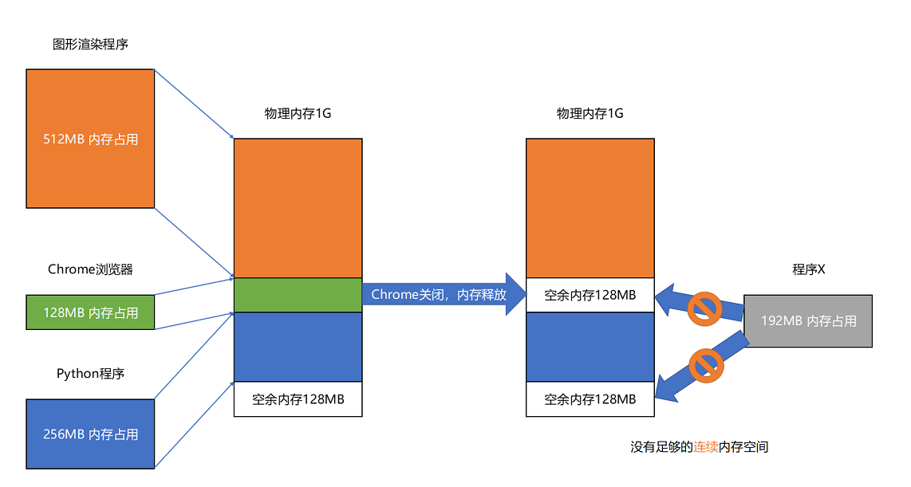

### 程序装载面临的挑战
- 可执行程序加载后占用的内存空间应该是连续的。
- 我们需要同时加载很多个程序，并且不能让程序自己规定在内存中加载的位置
- 我们把指令里用到的内存地址叫作**虚拟内存地址**（Virtual Memory Address），实际在内存硬件里面的空间地址，我们叫**物理内存地址**（Physical Memory Address）。

### 内存分段
- 找出一段连续的物理内存和虚拟内存地址进行映射的方法，我们叫**分段**（Segmentation）。这里的段，就是指系统分配出来的那个连续的内存空间。

- 分段会有**内存碎片**（Memory Fragmentation）的问题

- 内存碎片的问题可以通过内存交换（Memory Swapping）来解决
 
- 虚拟内存、分段，再加上内存交换，看起来似乎已经解决了计算机同时装载运行很多个程序的问题。但三者的组合仍然会遇到一个性能瓶颈。硬盘的访问速度要比内存慢很多，而每一次内存交换，我们都需要把一大段连续的内存数据写到硬盘上。

### 内存分页
- 和分段这样分配一整段连续的空间给到程序相比，**分页**（Paging）是把整个物理内存空间切成一段段固定尺寸的大小
 
- 由于内存空间都是预先划分好的，也就没有了不能使用的碎片，而只有被释放出来的很多 4KB 的页
 
- 当要读取特定的页，却发现数据并没有加载到物理内存里的时候，就会触发一个来自于 CPU 的缺页错误（Page Fault）。我们的操作系统会捕捉到这个错误，然后将对应的页，从存放在硬盘上的虚拟内存里读取出来，加载到物理内存里。这种方式，使得我们可以运行那些远大于我们实际物理内存的程序

- 通过虚拟内存、内存交换和内存分页这三个技术的组合，我们最终得到了一个让程序不需要考虑实际的物理内存地址、大小和当前分配空间的解决方案.这也是我们在计算机的软硬件开发中常用的一种方法，就是**加入一个间接层**。