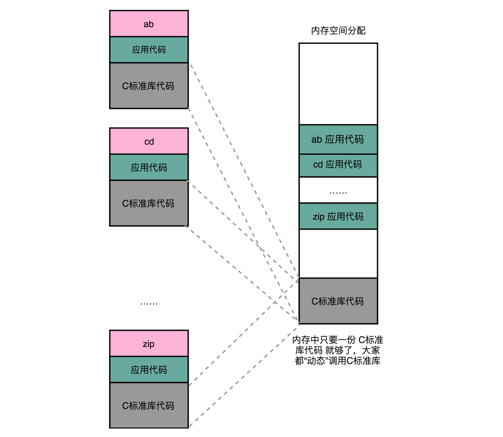

### 链接可以分动、静，共享运行省内存
 - **静态链接**（Static Link）,如果我们有很多个程序都要通过装载器装载到内存里面，那里面链接好的同样的功能代码，也都需要再装载一遍，再占一遍内存空间。
 
 - **动态链接**（Dynamic Link）,同样功能的代码，在不同的程序里面，不需要各占一份内存空间。在动态链接的过程中，我们想要“链接”的，不是存储在硬盘上的目标文件代码，而是加载到内存中的**共享库**（Shared Libraries）
 
### 地址无关很重要，相对地址解烦恼
- 要想要在程序运行的时候共享代码，也有一定的要求，就是这些机器码必须是“地址无关”的。也就是说，我们编译出来的共享库文件的指令代码，是**地址无关码**（Position-Independent Code）。换句话说就是，这段代码，无论加载在哪个内存地址，都能够正常执行。如果不是这样的代码，就是地址相关的代码。
 

- 动态代码库内部的变量和函数调用都很容易解决，我们只需要使用相对地址（Relative Address）就好了。各种指令中使用到的内存地址，给出的不是一个绝对的地址空间，而是一个相对于当前指令偏移量的内存地址

### PLT 和 GOT，动态链接的解决方案
- 在共享库的 data section 里面，保存了一张**全局偏移表**（GOT，Global Offset Table）。**虽然共享库的代码部分的物理内存是共享的，但是数据部分是各个动态链接它的应用程序里面各加载一份的。
**