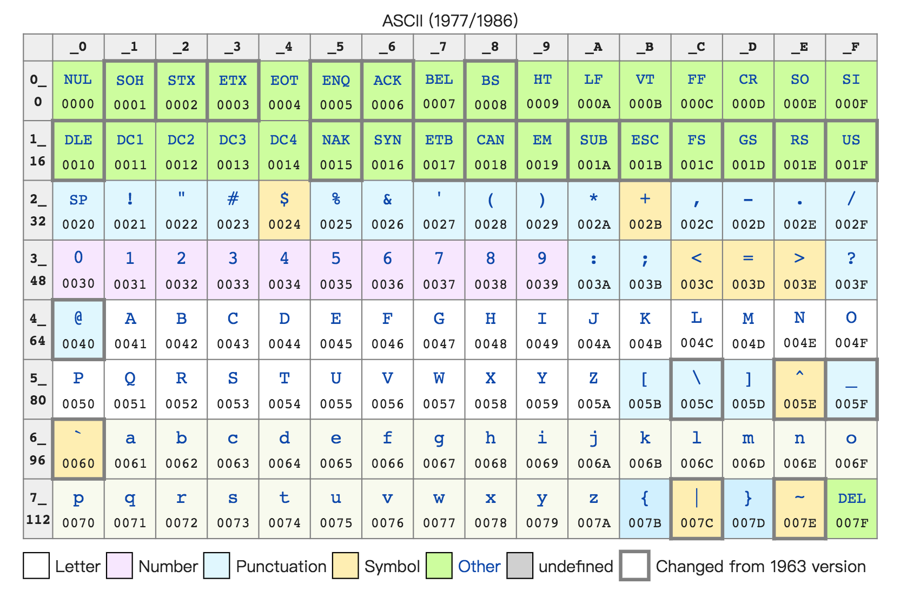
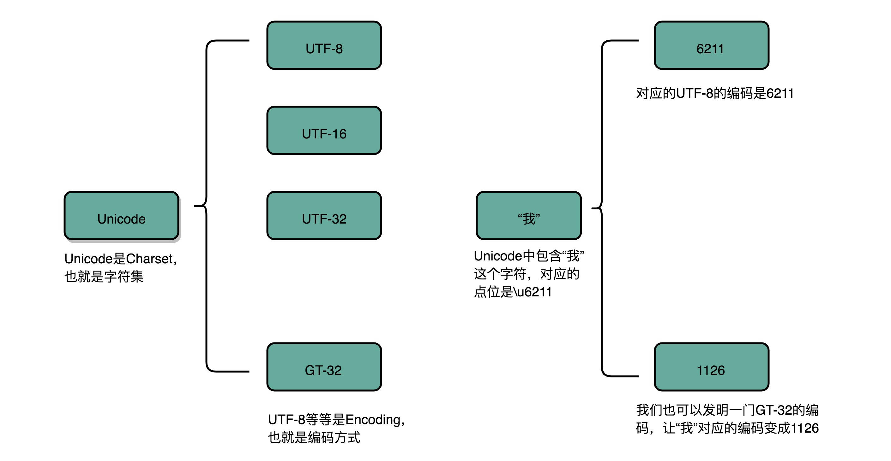

### 理解二进制的“逢二进一”
- 一个 4 位的二进制数， 0011 就表示为 +3。而 1011 最左侧的第一位是 1，所以它就表示 -3。这个其实就是整数的**原码表示法**

### 字符串的表示，从编码到数字
- **ASCII 码**就好比一个字典，用 8 位二进制中的 128 个不同的数，映射到 128 个不同的字符里
- 字符串 15 不是用 0000 1111 这 8 位来表示，而是变成两个字符 1 和 5 连续放在一起，也就是 0011 0001 和 0011 0101，需要用两个 8 位来表示。
- 最大的 32 位整数，就是 2147483647。如果用整数表示法，只需要 32 位就能表示了。但是如果用字符串来表示，一共有 10 个字符，每个字符用 8 位的话，需要整整 80 位。比起整数表示法，要多占很多空间。
- 很多时候我们在存储数据的时候，要采用二进制序列化这样的方式，而不是简单地把数据通过 CSV 或者 JSON，这样的文本格式存储来进行序列化。不管是整数也好，浮点数也好，采用二进制序列化会比存储文本省下不少空间。
 
 - 字符集，表示的可以是字符的一个集合,字符编码则是对于字符集里的这些字符，怎么一一用二进制表示出来的一个字典
 

 