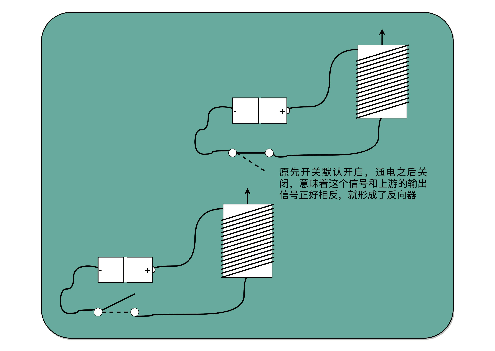

### 从信使到电报，我们怎么做到“千里传书”？
- 电报传输的信号有两种，一种是短促的点信号（dot 信号），一种是长一点的划信号（dash 信号）。我们把“点”当成“1”，把“划”当成“0”。这样一来，我们的电报信号就是另一种特殊的二进制编码了

### 理解继电器，给跑不动的信号续一秒

- 为了能够实现这样接力传输信号，在电路里面，工程师们造了一个叫作继电器（Relay）的设备。
 
 - 中继，其实就是不断地通过新的电源重新放大已经开始衰减的原有信号

- 提供串联的两个开关，只有两个开关都打开，电路才接通，输出的开关也才能接通，这其实就是模拟了计算机里面的“与”操作。

- 提供两条独立的线路到输出端，两条线路上各有一个开关，那么任何一个开关打开了，到输出端的电路都是接通的，这其实就是模拟了计算机中的“或”操作。

- 当我们把输出端的“螺旋线圈 + 磁性开关”的组合，从默认关掉，只有通电有了磁场之后打开，换成默认是打开通电的，只有通电之后才关闭，我们就得到了一个计算机中的“非”操作。输出端开和关正好和输入端相反。这个在数字电路中，也叫作**反向器**（Inverter）
 

 