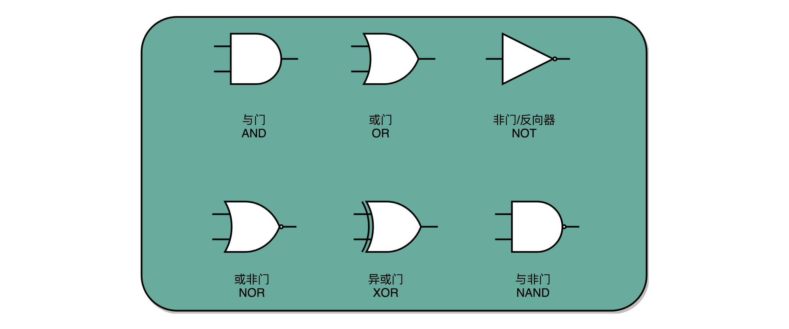

 ### 异或门和半加器

 
 - 一方面，我们需要知道，加法计算之后的个位是什么，在输入的两位是 00 和 11 的情况下，对应的输出都应该是 0；在输入的两位是 10 和 01 的情况下，输出都是 1。结果你会发现，这个输入和输出的对应关系，其实就是“异或门（XOR）”。**异或门就是一个最简单的整数加法，所需要使用的基本门电路。**

 - 输入的两位都是 11 的时候，我们还需要向更左侧的一位进行进位。对应一个与门。

- 我们把两个门电路打包，给它取一个名字，就叫作半加器（Half Adder）。

 

 ### 全加器

 - 半加器可以解决个位的加法问题，但是如果放到二位上来说，就不够用了

 - 二位用一个半加器不能计算完成的原因也很简单。因为二位除了一个加数和被加数之外，还需要加上来自个位的进位信号，一共需要三个数进行相加，才能得到结果。

 - 我们用两个半加器和一个或门，就能组合成一个全加器

  

  - 唯一需要注意的是，对于这个全加器，在个位，我们只需要用一个半加器，或者让全加器的进位输入始终是 0。因为个位没有来自更右侧的进位。而最左侧的一位输出的进位信号，表示的并不是再进一位，而是表示我们的加法是否溢出了。

  - 在整个加法器的结果中，我们其实有一个电路的信号，会标识出加法的结果是否溢出。我们可以把这个对应的信号，输出给到硬件中其他标志位里，让我们的计算机知道计算的结果是否溢出。