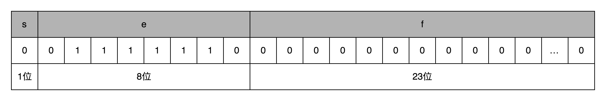

### 浮点数的不精确性
-  0.3 + 0.6 = 0.8999999999999999 in Python console

### 定点数的表示
- 我们把最右边的 2 个 0～9 的整数，当成小数部分；把左边 6 个 0～9 的整数，当成整数部分。这样，我们就可以用 32 个比特，来表示从 0 到 999999.99 这样 1 亿个实数了。这种用二进制来表示十进制的编码方式，叫作**BCD 编码**（Binary-Coded Decimal）
  - **第一，这样的表示方式有点“浪费”。**
  - **第二，这样的表示方式没办法同时表示很大的数字和很小的数字。**

### 浮点数的表示
- 单精度的 32 个比特可以分成三部分。
 
  - 第一部分是一个**符号位**，用来表示是正数还是负数。我们一般用s来表示。
  - 接下来是一个 8 个比特组成的**指数位**。8 个比特能够表示的整数空间，就是 0～255。我们在这里用 1～254 映射到 -126～127 这 254 个有正有负的数上。
  - 最后是一个 23 个比特组成的有效数位。我们用f来表示
  - 表达式:(−1)s×1.f×2e
- 我们可以以 0.5 为例子。0.5 的符号为 s 应该是 0，f 应该是 0，而 e 应该是 -1，也就是0.5=(−1)0×1.0×2−1=0.5，对应的浮点数表示，就是 32 个比特。
 
 
