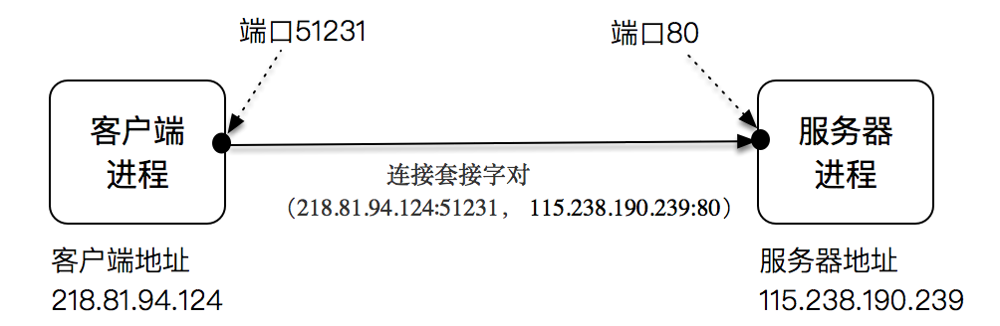
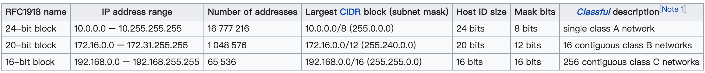

### IP 和端口

### 保留网段
- 下表是三个保留网段，其可以容纳的计算机主机个数分别是 16777216 个、1048576 个和 65536 个。

### 子网掩码
- 在网络 IP 划分的时候，我们需要区分两个概念。
  - 第一是网络（network）的概念，直观点说，它表示的是这组 IP 共同的部分，比如在 192.168.1.1~192.168.1.255 这个区间里，它们共同的部分是 192.168.1.0。
  - 第二是主机（host）的概念，它表示的是这组 IP 不同的部分，上面的例子中 1~255 就是不同的那些部分，表示有 255 个可用的不同 IP。

- IPv4 地址，192.0.2.12，我们可以说前面三个 bytes 是子网，最后一个 byte 是 host，或者换个方式，我们能说 host 为 8 位，子网掩码为 192.0.2.0/24（255.255.255.0）。