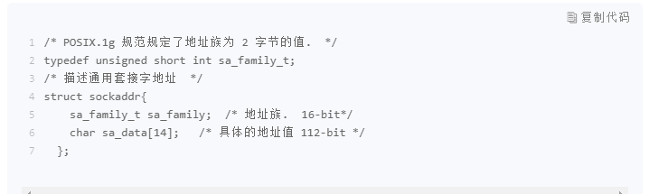

### socket 到底是什么？

- 客户端进程向操作系统内核发起 write 字节流写操作，内核协议栈将字节流通过网络设备传输到服务器端，服务器端从内核得到信息，将字节流从内核读入到进程中，并开始业务逻辑的处理，完成之后，服务器端再将得到的结果以同样的方式写给客户端。可以看到，**一旦连接建立，数据的传输就不再是单向的，而是双向的，这也是 TCP 的一个显著特性。**

### 套接字地址格式
- 套接字的通用地址结构：

- 第一个字段是地址族，它表示使用什么样的方式对地址进行解释和保存,常用的有以下几种：
  - AF_LOCAL：表示的是本地地址，对应的是 Unix 套接字，这种情况一般用于本地 socket 通信，很多情况下也可以写成 AF_UNIX、AF_FILE；
  - AF_INET：因特网使用的 IPv4 地址；
  - AF_INET6：因特网使用的 IPv6 地址。

### 几种套接字地址格式比较
