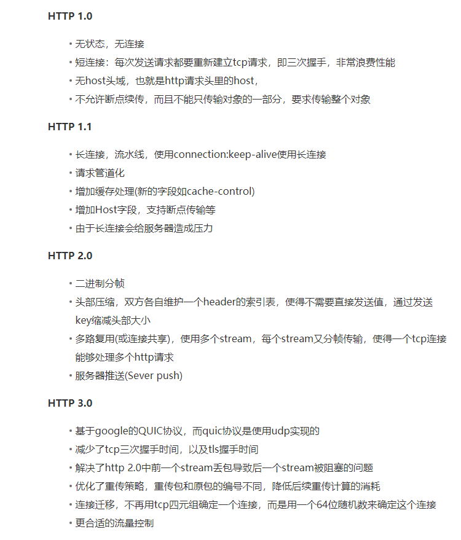

> 0.9和1.0这两个版本，就是最传统的 request – response的模式，HTTP 0.9版本的协议简单到极点，请求时，不支持请求头，只支持 GET方法，HTTP1.0加了HTTP版本号、Header、Content-Type。

> HTTP1.1有了keepalive 来让HTTP重用TCP链接，支持pipeline网络传输，只要第一个请求发出去了，不用等它回来，就可以发第二个请求出去，加了Host、加了OPTIONS支持跨域

> HTTP1.1借助耗CPU的zip压缩的方式减少网络带宽，但是耗了前端和后端的CPU,所以HTTP/2是一个二进制协议，增加了数据传输的效率，
HTTP/2是可以在一个TCP链接中并发请求多个HTTP请求，HTTP/2会压缩头，有服务端push

> HTTP2有一个Head-of-Line Blocking，HTTP/2 多请求复用一个TCP连接，一旦发生丢包，就会block住所有的HTTP请求，UDP/QUIC