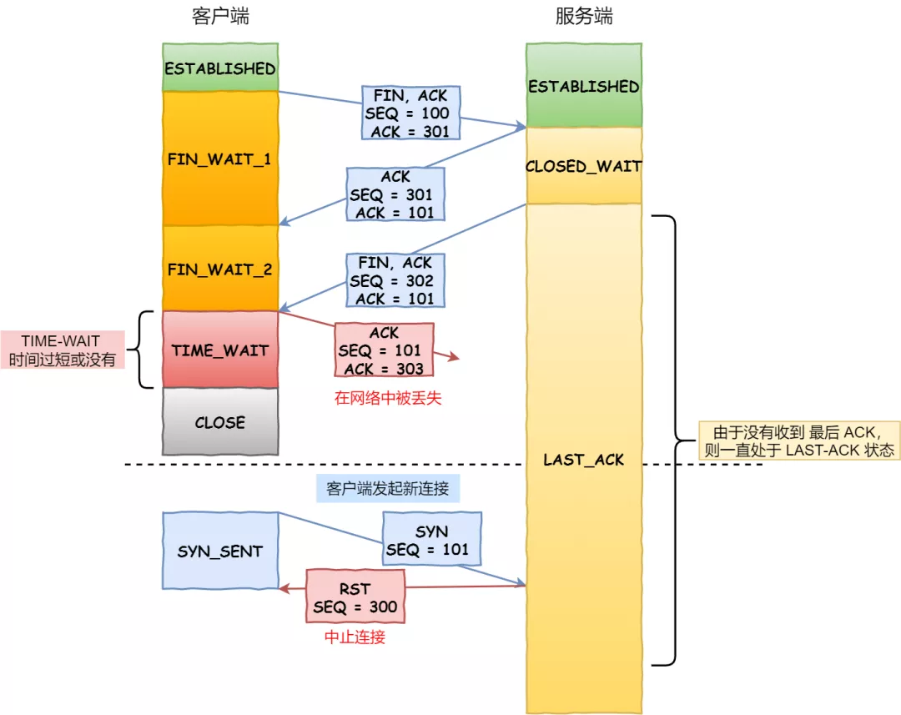
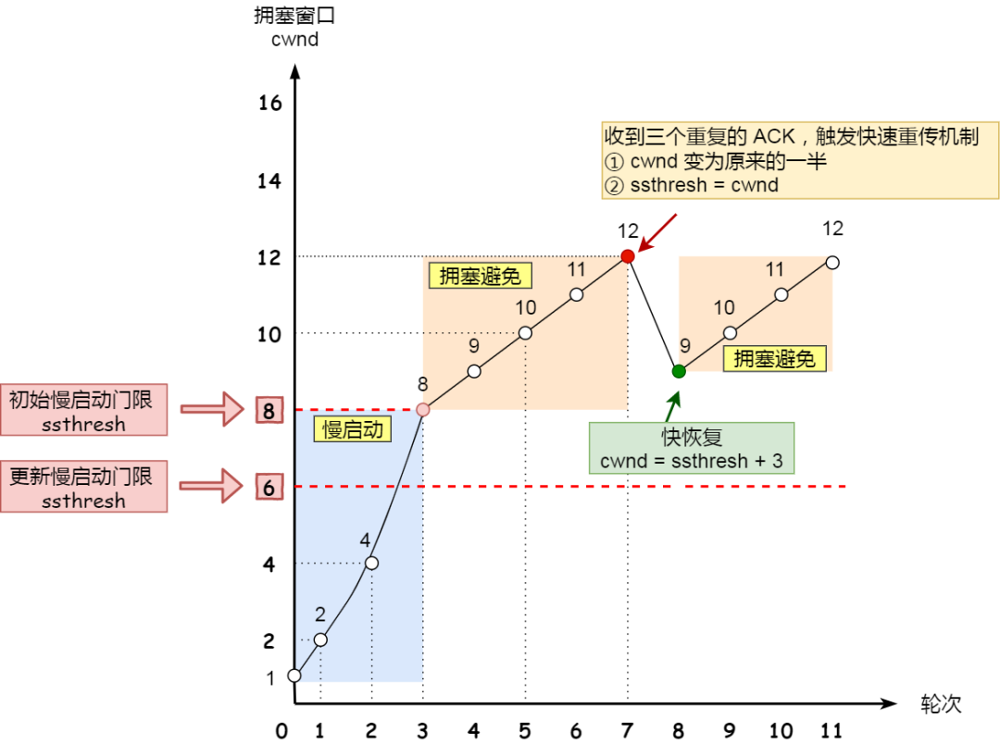

## TCP 头部报文格式
 
- 序列号：在建立连接时由计算机生成的随机数作为其初始值，通过 SYN 包传给接收端主机，每发送一次数据，就「累加」一次该「数据字节数」的大小。**用来解决网络包乱序问题**。
- 确认应答号：指下一次「期望」收到的数据的序列号，发送端收到这个确认应答以后可以认为在这个序号以前的数据都已经被正常接收。用来**解决不丢包的问题**。

- 控制位：
  - ACK：该位为 1 时，「确认应答」的字段变为有效，TCP 规定除了最初建立连接时的 SYN 包之外该位必须设置为 1 。
  - RST：该位为 1 时，表示 TCP 连接中出现异常必须强制断开连接。
  - SYC：该位为 1 时，表示希望建立连，并在其「序列号」的字段进行序列号初始值的设定。
  - FIN：该位为 1 时，表示今后不会再有数据发送，希望断开连接。当通信结束希望断开连接时，通信双方的主机之间就可以相互交换 FIN 位置为 1 的 TCP 段。

## TCP建立连接

- 第三次握手可以携带数据
- 通过三次握手能**防止历史连接的建立，能减少双方不必要的资源开销，能帮助双方同步初始化序列号**
- 不使用「两次握手」和「四次握手」的原因：
  - 「两次握手」：无法防止历史连接的建立，会造成双方资源的浪费，也无法可靠的同步双方序列号；
  - 「四次握手」：三次握手就已经理论上最少可靠连接建立，所以不需要使用更多的通信次数。

## SYN攻击
- 其中一种解决方式是通过修改 Linux 内核参数
- 第二种 net.ipv4.tcp_syncookies = 1
  - 当 「 SYN 队列」满之后，后续服务器收到 SYN 包，不进入「 SYN 队列」；
  - 计算出一个 cookie 值，再以 SYN + ACK 中的「序列号」返回客户端，
  - 服务端接收到客户端的应答报文时，服务器会检查这个 ACK 包的合法性。如果合法，直接放入到「 Accept 队列」。

## TCP断开连接

- 主动关闭连接的，才有 TIME_WAIT 状态。
- 为什么挥手需要四次
  - 关闭连接时，客户端向服务端发送 FIN 时，仅仅表示客户端不再发送数据了但是还能接收数据。.
  - 服务器收到客户端的 FIN 报文时，先回一个 ACK 应答报文，而服务端可能还有数据需要处理和发送，等服务端不再发送数据时，才发送 FIN 报文给客户端来表示同意现在关闭连接。
- 为什么 TIME_WAIT 等待的时间是 2MSL
  - MSL 是 Maximum Segment Lifetime
  - TIME_WAIT 等待 2 倍的 MSL，比较合理的解释是：网络中可能存在来自发送方的数据包，当这些发送方的数据包被接收方处理后又会向对方发送响应，所以一来一回需要等待 2 倍的时间。
- 为什么需要 TIME_WAIT 状态
  - 防止具有相同「四元组」的「旧」数据包被收到；
  
  - 保证「被动关闭连接」的一方能被正确的关闭，即保证最后的 ACK 能让被动关闭方接收，从而帮助其正常关闭；
  
  - 经过 2MSL 这个时间，**足以让两个方向上的数据包都被丢弃，使得原来连接的数据包在网络中都自然消失，再出现的数据包一定都是新建立连接所产生的。**

- TIME_WAIT 过多有什么危害
  - 第一是内存资源占用；
  - 第二是对端口资源的占用，一个 TCP 连接至少消耗一个本地端口；

## 理解RESTful架构
- 越来越多的人开始意识到，**网站即软件**，而且是一种新型的软件。
- REST，即Representational State Transfer的缩写
- REST面向资源
- 综述 
  - （1）每一个URI代表一种资源；
  - （2）客户端和服务器之间，传递这种资源的某种表现层；
  - （3）客户端通过四个HTTP动词，对服务器端资源进行操作，实现"表现层状态转化"。

## 输入网址按下Enter会发生什么
- 解析URL,生成HTTP请求信息
- DNS(递归、迭代)
 
- 可靠传输TCP
- 远程定位IP
- 两点传输MAC（ARP缓存）
- 网卡，将数字信息转换为电信号
- 交换机、路由器

## TCP超时重传

- RTT（Round-Trip Time 往返时延），数据从网络一端传送到另一端所需的时间
- RTO （Retransmission Timeout 超时重传时间），超时重传时间 RTO 的值应该略大于报文往返  RTT 的值，但因网络情况变化，「超时重传时间 RTO 的值」应该是一个动态变化的值
- 再次超时的时候，又需要重传的时候，TCP 的策略是超时间隔加倍。

## TCP快速重传

- 发送端收到了三个 Ack = 2 的确认，知道了 Seq2 还没有收到，就会在定时器过期之前，重传丢失的 Seq2
- SACK、D-SACK

## TCP滑动窗口

- 窗口大小就是指无需等待确认应答，而可以继续发送数据的最大值，实际上是操作系统开辟的一个缓存空间

## TCP流量控制
- 窗口概念

## TCP拥塞控制
- 流量控制是避免「发送方」的数据填满「接收方」的缓存，但是并不知道网络的中发生了什么
- TCP 不能忽略网络上发生的事，它被设计成一个无私的协议，当网络发送拥塞时，TCP 会自我牺牲，降低发送的数据量
- 慢启动(超时重传)、拥塞避免、拥塞发生、快速恢复(快速重传)

## HTTP 1.0，1.1，2.0 的主要区别
- Http1.x，线程阻塞，在同一时间，同一域名的请求有一定数量限制，超过限制数目的请求会被阻塞
- http1.0，浏览器与服务器只保持短暂的连接，浏览器的每次请求都需要与服务器建立一个TCP连接，解决方案：添加头信息——非标准的Connection字段Connection: keep-alive
- http1.1，持久连接、管道机制、分块传输编码、新增请求方式，缺点虽然允许复用TCP连接，但是同一个TCP连接里面，所有的数据通信是按次序进行的。服务器只有处理完一个请求，才会接着处理下一个请求。如果前面的处理特别慢，后面就会有许多请求排队等着。这将导致“队头堵塞”
- HTTP/2.0，采用二进制格式而非文本格式；完全多路复用，而非有序并阻塞的、只需一个连接即可实现并行；服务器推送

## TCP 粘包和拆包
- 当应用层协议使用 TCP 协议传输数据时，TCP 协议可能会将应用层发送的数据分成多个包依次发送，而数据的接收方收到的数据段可能有多个『应用层数据包』组成，所以当应用层从 TCP 缓冲区中读取数据时发现粘连的数据包时，需要对收到的数据进行拆分。
- 粘包并不是 TCP 协议造成的，它的出现是因为应用层协议设计者对 TCP 协议的错误理解，忽略了 TCP 协议的定义并且缺乏设计应用层协议的经验。
- 使用消息边界解决。一种是使用固定长度，所有的应用层消息都使用统一的大小，另一种方式是使用不固定长度，但是需要在应用层协议的协议头中增加表示负载长度的字段。

## 延迟ACK&&累计ACK
- 延迟ACK减轻负担，提高传输速率
- 累计ACK，同时发送同时接收

## DNS查询
- 王道PPT

## HTTP状态码
- 301 Move Permanently，可以简单地理解为该资源已经被永久改变了位置，返回301状态码进行跳转被Google认为是将网站地址由 HTTP 迁移到 HTTPS 的最佳方法
- 304 Not Modified，说明无需再次传输请求的内容，也就是说可以使用缓存的内容。
- 401 Unauthorized，代表未经授权的访问
- 403 Forbidden，可以简单的理解为没有权限访问此站，服务器收到请求但拒绝提供服务。

## 简述什么是 XSS 攻击以及 CSRF 攻击

#### XSS 
- Cross-Site Scripting（跨站脚本攻击）简称 XSS，是一种代码注入攻击。攻击者通过在目标网站上注入恶意脚本，使之在用户的浏览器上运行。利用这些恶意脚本，攻击者可获取用户的敏感信息如 Cookie、SessionID 等，进而危害数据安全
- XSS 的本质是：恶意代码未经过滤，与网站正常的代码混在一起；浏览器无法分辨哪些脚本是可信的，导致恶意脚本被执行。

- XSS攻击类型
  - 存储型 XSS，攻击者将恶意代码提交到目标网站的数据库中，用户打开目标网站时，网站服务端将恶意代码从数据库取出，拼接在 HTML 中返回给浏览器，这种攻击常见于带有用户保存数据的网站功能，如论坛发帖、商品评论、用户私信等。
  - 反射型 XSS，攻击者构造出特殊的 URL，其中包含恶意代码。用户打开带有恶意代码的 URL 时，网站服务端将恶意代码从 URL 中取出，拼接在 HTML 中返回给浏览器。反射型 XSS 跟存储型 XSS 的区别是：存储型 XSS 的恶意代码存在数据库里，反射型 XSS 的恶意代码存在 URL 里。
  - DOM 型 XSS，DOM 型 XSS 跟前两种 XSS 的区别：DOM 型 XSS 攻击中，取出和执行恶意代码由浏览器端完成，属于前端 JavaScript 自身的安全漏洞，而其他两种 XSS 都属于服务端的安全漏洞。

- XSS 攻击的预防
  - 输入过滤
  - 后端
  - 输入内容长度控制
  - HTTP-only Cookie: 禁止 JavaScript 读取某些敏感 Cookie
  - 验证码：防止脚本冒充用户提交危险操作。

#### CSRF
 - CSRF（Cross-site request forgery）跨站请求伪造：攻击者诱导受害者进入第三方网站，在第三方网站中，向被攻击网站发送跨站请求。利用受害者在被攻击网站已经获取的注册凭证，绕过后台的用户验证，达到冒充用户对被攻击的网站执行某项操作的目的。
 - 防护策略
   - CSRF自动防御策略：同源检测（Origin 和 Referer 验证）。
   - CSRF主动防御措施：Token验证 或者 双重Cookie验证 以及配合Samesite Cookie。
   - 保证页面的幂等性，后端接口不要在GET页面中做用户操作。
## TCP 在什么情况下服务端会出现大量 CLOSE_WAIT
- 资源没有关闭
## SSL握手流程为什么要使用对称秘钥？
- https://www.ruanyifeng.com/blog/2014/02/ssl_tls.html

## DDOS
- HTTP 请求的拦截,拦截特征IP
  - （1）专用硬件
  - （2）本机防火墙
  - （3）Web 服务器
- 带宽扩容
- CDN

## BGP和OSPF

## 简述在四层和七层网络协议中负载均衡的原理

