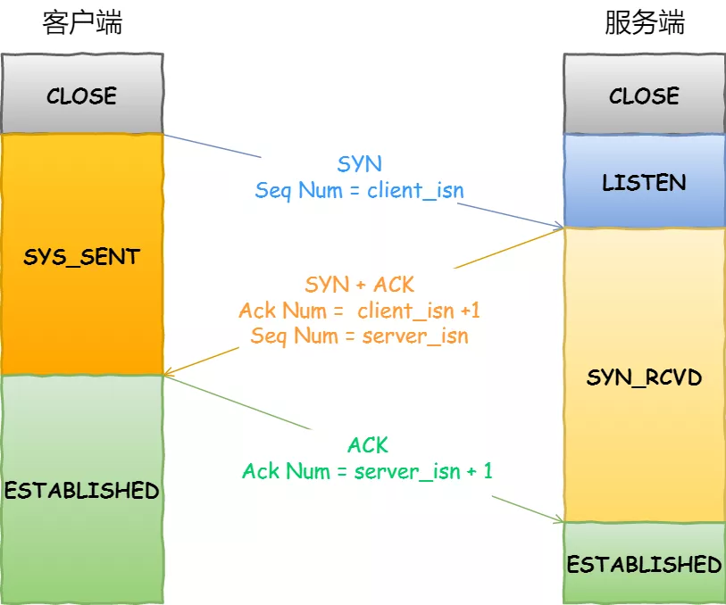
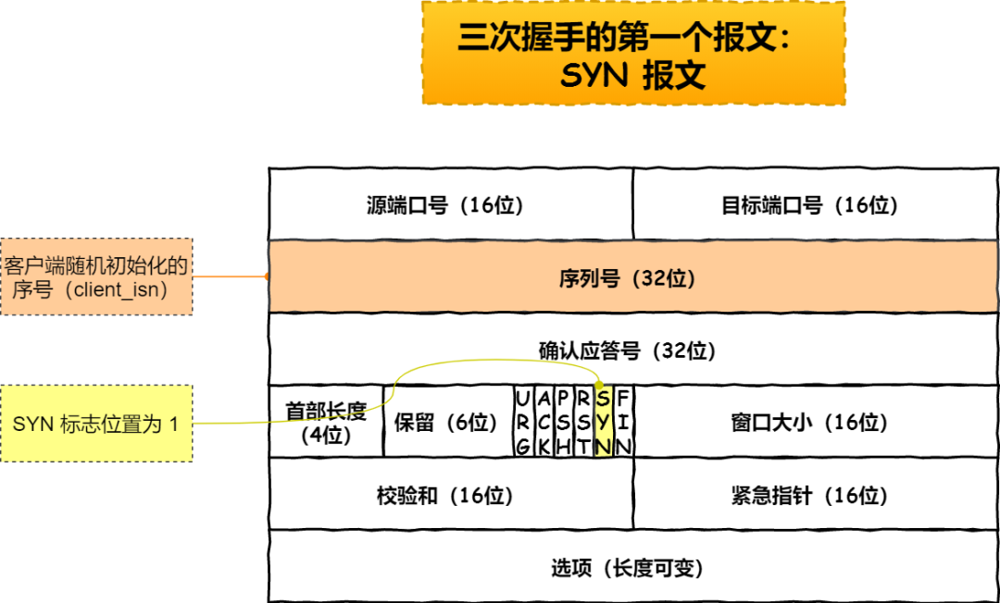
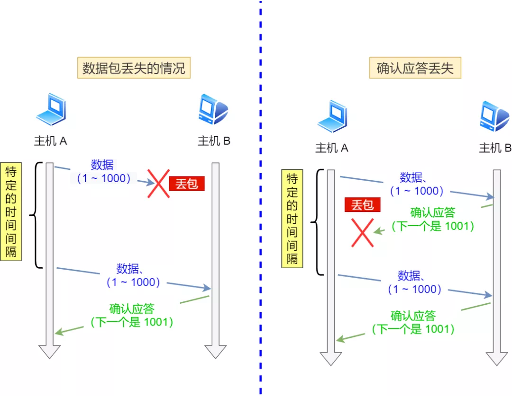

## TCP 头部报文格式
 
- 序列号：在建立连接时由计算机生成的随机数作为其初始值，通过 SYN 包传给接收端主机，每发送一次数据，就「累加」一次该「数据字节数」的大小。**用来解决网络包乱序问题**。
- 确认应答号：指下一次「期望」收到的数据的序列号，发送端收到这个确认应答以后可以认为在这个序号以前的数据都已经被正常接收。用来**解决不丢包的问题**。

- 控制位：
  - ACK：该位为 1 时，「确认应答」的字段变为有效，TCP 规定除了最初建立连接时的 SYN 包之外该位必须设置为 1 。
  - RST：该位为 1 时，表示 TCP 连接中出现异常必须强制断开连接。
  - SYC：该位为 1 时，表示希望建立连，并在其「序列号」的字段进行序列号初始值的设定。
  - FIN：该位为 1 时，表示今后不会再有数据发送，希望断开连接。当通信结束希望断开连接时，通信双方的主机之间就可以相互交换 FIN 位置为 1 的 TCP 段。

## TCP建立连接

- 第三次握手可以携带数据
- 通过三次握手能**防止历史连接的建立，能减少双方不必要的资源开销，能帮助双方同步初始化序列号**
- 不使用「两次握手」和「四次握手」的原因：
  - 「两次握手」：无法防止历史连接的建立，会造成双方资源的浪费，也无法可靠的同步双方序列号；
  - 「四次握手」：三次握手就已经理论上最少可靠连接建立，所以不需要使用更多的通信次数。

## SYN攻击
- 其中一种解决方式是通过修改 Linux 内核参数
- 第二种 net.ipv4.tcp_syncookies = 1
  - 当 「 SYN 队列」满之后，后续服务器收到 SYN 包，不进入「 SYN 队列」；
  - 计算出一个 cookie 值，再以 SYN + ACK 中的「序列号」返回客户端，
  - 服务端接收到客户端的应答报文时，服务器会检查这个 ACK 包的合法性。如果合法，直接放入到「 Accept 队列」。

## TCP断开连接

- 主动关闭连接的，才有 TIME_WAIT 状态。
- 为什么挥手需要四次
  - 关闭连接时，客户端向服务端发送 FIN 时，仅仅表示客户端不再发送数据了但是还能接收数据。.
  - 服务器收到客户端的 FIN 报文时，先回一个 ACK 应答报文，而服务端可能还有数据需要处理和发送，等服务端不再发送数据时，才发送 FIN 报文给客户端来表示同意现在关闭连接。
- 为什么 TIME_WAIT 等待的时间是 2MSL
  - MSL 是 Maximum Segment Lifetime
  - TIME_WAIT 等待 2 倍的 MSL，比较合理的解释是：网络中可能存在来自发送方的数据包，当这些发送方的数据包被接收方处理后又会向对方发送响应，所以一来一回需要等待 2 倍的时间。
- 为什么需要 TIME_WAIT 状态
  - 防止具有相同「四元组」的「旧」数据包被收到；
  
  - 保证「被动关闭连接」的一方能被正确的关闭，即保证最后的 ACK 能让被动关闭方接收，从而帮助其正常关闭；
  
  - 经过 2MSL 这个时间，**足以让两个方向上的数据包都被丢弃，使得原来连接的数据包在网络中都自然消失，再出现的数据包一定都是新建立连接所产生的。**

- TIME_WAIT 过多有什么危害
  - 第一是内存资源占用；
  - 第二是对端口资源的占用，一个 TCP 连接至少消耗一个本地端口；

## 理解RESTful架构
- 越来越多的人开始意识到，**网站即软件**，而且是一种新型的软件。
- REST，即Representational State Transfer的缩写
- REST面向资源
- 综述 
  - （1）每一个URI代表一种资源；
  - （2）客户端和服务器之间，传递这种资源的某种表现层；
  - （3）客户端通过四个HTTP动词，对服务器端资源进行操作，实现"表现层状态转化"。

## 输入网址按下Enter会发生什么
- 解析URL,生成HTTP请求信息
- DNS(递归、迭代)
 
- 可靠传输TCP
- 远程定位IP
- 两点传输MAC（ARP缓存）
- 网卡，将数字信息转换为电信号
- 交换机、路由器

## TCP超时重传

- RTT（Round-Trip Time 往返时延），数据从网络一端传送到另一端所需的时间
- RTO （Retransmission Timeout 超时重传时间），超时重传时间 RTO 的值应该略大于报文往返  RTT 的值，但因网络情况变化，「超时重传时间 RTO 的值」应该是一个动态变化的值
- 再次超时的时候，又需要重传的时候，TCP 的策略是超时间隔加倍。

## TCP快速重传

- 发送端收到了三个 Ack = 2 的确认，知道了 Seq2 还没有收到，就会在定时器过期之前，重传丢失的 Seq2
- SACK、D-SACK

## TCP滑动窗口

- 窗口大小就是指无需等待确认应答，而可以继续发送数据的最大值，实际上是操作系统开辟的一个缓存空间

## TCP流量控制
- 窗口概念

## TCP拥塞控制
- 流量控制是避免「发送方」的数据填满「接收方」的缓存，但是并不知道网络的中发生了什么
- TCP 不能忽略网络上发生的事，它被设计成一个无私的协议，当网络发送拥塞时，TCP 会自我牺牲，降低发送的数据量
- 慢启动、拥塞避免、拥塞发生、快速恢复

