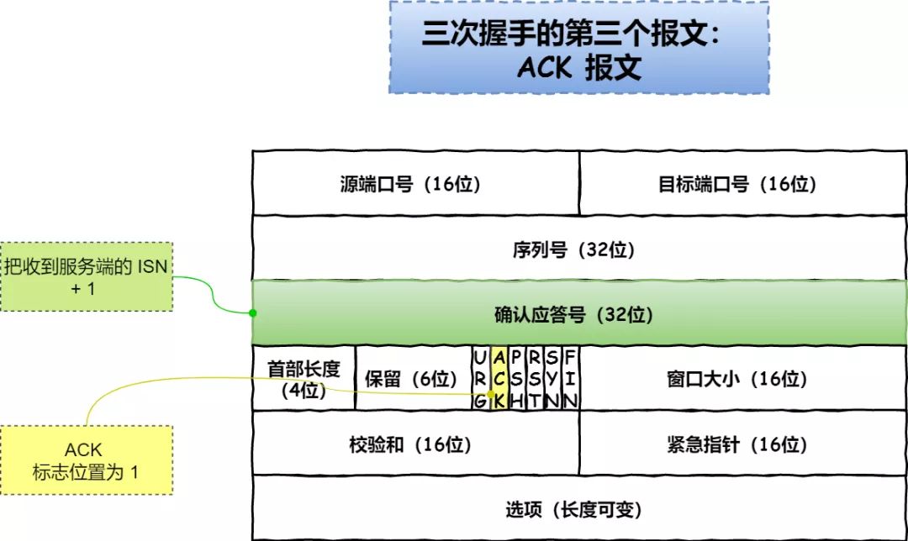
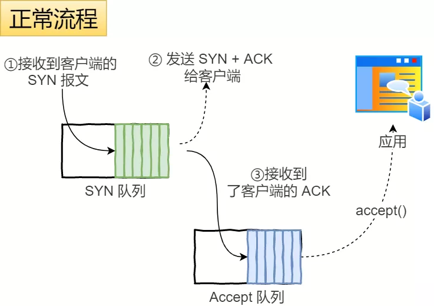

## TCP 头部报文格式
 
- 序列号：在建立连接时由计算机生成的随机数作为其初始值，通过 SYN 包传给接收端主机，每发送一次数据，就「累加」一次该「数据字节数」的大小。**用来解决网络包乱序问题**。
- 确认应答号：指下一次「期望」收到的数据的序列号，发送端收到这个确认应答以后可以认为在这个序号以前的数据都已经被正常接收。用来**解决不丢包的问题**。

- 控制位：
  - ACK：该位为 1 时，「确认应答」的字段变为有效，TCP 规定除了最初建立连接时的 SYN 包之外该位必须设置为 1 。
  - RST：该位为 1 时，表示 TCP 连接中出现异常必须强制断开连接。
  - SYC：该位为 1 时，表示希望建立连，并在其「序列号」的字段进行序列号初始值的设定。
  - FIN：该位为 1 时，表示今后不会再有数据发送，希望断开连接。当通信结束希望断开连接时，通信双方的主机之间就可以相互交换 FIN 位置为 1 的 TCP 段。

## TCP建立连接断开连接

- 第三次握手可以携带数据
- 通过三次握手能**防止历史连接的建立，能减少双方不必要的资源开销，能帮助双方同步初始化序列号**
- 不使用「两次握手」和「四次握手」的原因：
  - 「两次握手」：无法防止历史连接的建立，会造成双方资源的浪费，也无法可靠的同步双方序列号；
  - 「四次握手」：三次握手就已经理论上最少可靠连接建立，所以不需要使用更多的通信次数。

## SYN攻击
- 其中一种解决方式是通过修改 Linux 内核参数
- 第二种 net.ipv4.tcp_syncookies = 1
  - 当 「 SYN 队列」满之后，后续服务器收到 SYN 包，不进入「 SYN 队列」；
  - 计算出一个 cookie 值，再以 SYN + ACK 中的「序列号」返回客户端，
  - 服务端接收到客户端的应答报文时，服务器会检查这个 ACK 包的合法性。如果合法，直接放入到「 Accept 队列」。

